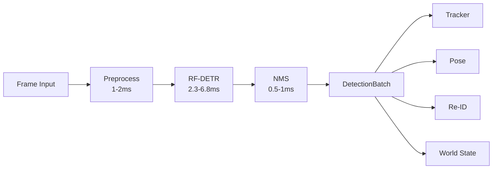

# Detection Pipeline Architecture

## Purpose

Detect and classify objects in each video frame. Produces bounding boxes, class labels, and confidence scores for every detected entity. This is the foundational component — all downstream tracking, pose, and reasoning depend on detection quality.

---

## Interfaces

### Input

```
FrameInput {
  frame_id:        uint64
  timestamp_ns:    uint64
  image:           Tensor[H, W, 3] uint8   # BGR or RGB
  stream_id:       string
  decode_latency_ms: float                  # time from wire to tensor
}
```

### Output

```
DetectionBatch {
  frame_id:        uint64
  timestamp_ns:    uint64
  detections:      Detection[]
  model_id:        string                   # e.g. "RF-DETR-S/1.8.2"
  inference_ms:    float                    # model inference only
  total_ms:        float                    # preprocess + inference + NMS
}

Detection {
  bbox_norm:       [4]float                 # [x_center, y_center, w, h] normalized 0-1
  class_id:        uint16
  class_name:      string
  score:           float                    # raw model output
  feature_ref:     string                   # embedding pointer for Re-ID
}
```

### API

```
detect_batch(frames: FrameInput[], config: DetectConfig) -> DetectionBatch
detect_single(frame: FrameInput, config: DetectConfig) -> DetectionBatch
```

---

## Data Flow



---

## Data Contracts

### Model Selection Decision Matrix

| Constraint | Model | Latency T4 | AP50:95 | Params |
|---|---|---|---|---|
| Ultra-fast (<2.5ms) | RF-DETR-N | 2.3ms | 48.4 | 30.5M |
| Fast (2.5-4ms) | RF-DETR-S | 3.5ms | 53.0 | 32.1M |
| Balanced (4-7ms) | RF-DETR-M | 4.4ms | 54.7 | 33.7M |
| High-accuracy (7-12ms) | RF-DETR-L | 6.8ms | 56.5 | 33.9M |
| Peak accuracy (12-18ms) | RF-DETR-XL | 11.5ms | 58.6 | 126.4M |

### Runtime Configuration

```
DetectConfig {
  model:           string                   # "RF-DETR-N" | "RF-DETR-S" | ...
  input_size:      [2]int                   # e.g. [512, 512] or [640, 640]
  confidence_threshold: float               # default 0.5
  nms_threshold:   float                    # default 0.7
  max_detections:  int                      # default 100
  device:          string                   # "cuda:0"
  precision:       string                   # "fp16" | "fp8" | "int8"
}
```

### Quality Flags

```
DetectionQuality {
  blur_score:               float           # 0=sharp, 1=blurry
  detector_in_distribution: float           # model confidence on OOD-ness
  input_occluded_frac:      float           # estimated occlusion
  compression_artifacts:    bool            # JPEG/H.264 block artifacts detected
}
```

---

## Latency Budget

### 30 FPS Critical Path (33.3ms total)

| Stage | Budget | Notes |
|---|---|---|
| Preprocess (resize, normalize) | 1–2 ms | Pinned memory, zero-copy |
| Model inference | 2.3–6.8 ms | RF-DETR-S or M |
| NMS / postprocess | 0.5–1 ms | CPU or GPU NMS |
| Output publish | 0.2–0.5 ms | Ring buffer write |
| **Total detection** | **4–10 ms** | Leaves 23–29ms for rest of pipeline |

### Async High-Accuracy Path (5–10 Hz)

- RF-DETR-L or XL on every 3rd–5th frame.
- Higher resolution (704×704 or 880×880).
- Results merged with fast-path detections via IoU matching.

---

## Dependencies

### Upstream
- `10_infrastructure/02_hardware_topology.md` — GPU assignment
- `01_perception/08_camera_motion.md` — Motion-compensated input (optional)

### Downstream
- `01_perception/03_tracking.md` — Receives DetectionBatch
- `01_perception/02_pose_estimation.md` — Crops from detections
- `01_perception/06_reid.md` — Feature vectors from detections
- `03_state/01_world_state.md` — Entity creation/update

---

## Failure Modes

| Failure | Detection | Response |
|---|---|---|
| Model OOM | CUDA OOM error | Downgrade to RF-DETR-N, reduce resolution |
| Latency spike >15ms | Timing monitor | Skip frame, propagate tracker prediction |
| All scores < threshold | Empty detection set | Report "no detections", don't trigger events |
| GPU thermal throttle | Utilization >95% | Reduce to N model, increase detector skip |
| Input corruption | Decoder error | Drop frame, log, continue |

---

## Reality Check 2026

### RF-DETR vs YOLO26 (from benchmark_report_2026.md):
- RF-DETR-S beats YOLO26-S at every matched latency tier (53.0 vs 47.7 AP50:95).
- YOLO26-N is faster (1.7ms vs 2.3ms) but gives up 8.1 AP.
- RF-DETR-2XL reaches 60.1 AP50:95 — no YOLO variant comes close.
- On CPU: YOLO26 wins decisively. RF-DETR has 30M+ params, no meaningful CPU path.
- RF100-VL (domain transfer): RF-DETR leads across all tiers due to DINOv2 pretraining.

### RTX 5090 Numbers:
- RF-DETR-L on RTX 5090 TRT FP16: 1.33ms, 753 FPS.
- RF-DETR-L end-to-end (with GPU preprocess): 1.56ms, 641 FPS.

### Third-Party Optimizations:
- RF-DETR-L on RTX 4090 JIT FP16: 6.1ms, 163 FPS.
- RF-DETR-L on RTX 4090 TRT FP16: 1.33ms, 753 FPS (optimized build).
