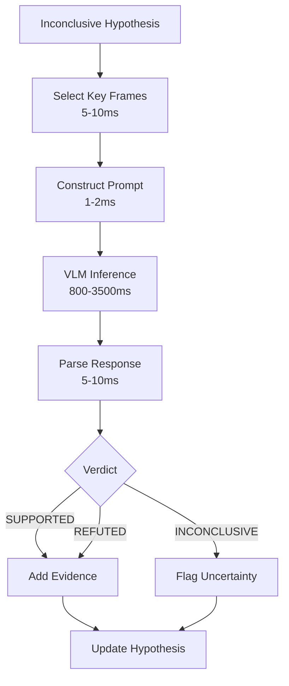

# Deep VLM Reasoner Architecture

## Purpose

Perform deep multimodal reasoning on hypotheses that cannot be verified by fast rules. Uses a VLM to reason about complex visual scenes, multi-step causal chains, and ambiguous situations. This is the "slow thinking" path — high quality, high latency, async.

---

## Interfaces

### Input

```
VLMReasoningInput {
  hypothesis:      Hypothesis
  world_state:     WorldStateSnapshot
  evidence:        Evidence[]
  context_frames:  Tensor[][H, W, 3]        # key frames for visual context
  context_text:    string                    # textual context (OCR, metadata)
  question:        string                    # specific question for VLM
}
```

### Output

```
VLMReasoningOutput {
  hypothesis_id:   string
  verdict:         Enum                     # SUPPORTED | REFUTED | INCONCLUSIVE
  confidence:      float
  reasoning:       string                    # natural language reasoning chain
  evidence_used:   Evidence[]
  new_evidence:    Evidence[]               # VLM found new evidence
  latency_ms:      float
  tokens_used:     int
  model_used:      string
}
```

### API

```
reason(input: VLMReasoningInput, config: VLMConfig) -> VLMReasoningOutput
batch_reason(inputs: VLMReasoningInput[], config: VLMConfig) -> VLMReasoningOutput[]
```

---

## Data Contracts

### Model Selection

| Model | Latency | Quality | Use Case |
|---|---|---|---|
| Qwen3-VL-30B-A3B (local) | 800–2000ms | High | Default local |
| Qwen3.5-397B (local, multi-GPU) | 1500–3500ms | Highest | Complex reasoning |
| Gemini 3.5 Flash (API) | 500–1500ms | High | Fast API |
| GPT-5.4 (API) | 1000–3000ms | High | Complex API |
| StreamingVLM | <100ms/tok | Moderate | Real-time only |

### Prompt Template

```
You are analyzing a video event. Given the following context:

Current state: {world_state_summary}
Evidence: {evidence_list}
Hypothesis: {hypothesis_claim}
Visual context: {frame_descriptions}

Question: {specific_question}

Respond with:
1. VERDICT: SUPPORTED / REFUTED / INCONCLUSIVE
2. CONFIDENCE: 0.0-1.0
3. REASONING: chain of reasoning
4. NEW EVIDENCE: any new observations (if any)
```

### Configuration

```
VLMConfig {
  model:           string                   # model to use
  max_tokens:      int                      # default 512
  temperature:     float                    # default 0.1 (low for factual)
  top_k:           int                      # default 5
  timeout_ms:      int                      # default 5000
  max_frames:      int                      # max visual context frames, default 5
  retry_count:     int                      # default 1
}
```

---

## Latency Budget

| Stage | Budget | Notes |
|---|---|---|
| Frame selection | 5–10ms | Key frame extraction |
| Prompt construction | 1–2ms | Template fill |
| VLM inference | 800–3500ms | Model-dependent |
| Response parsing | 5–10ms | Extract verdict/confidence |
| **Total** | **800–3500ms** | Async, event-triggered |

---

## Dependencies

### Upstream
- `05_reasoning/02_fast_verifier.md` — Inconclusive hypotheses
- `05_reasoning/04_evidence_graph.md` — Evidence context
- `04_memory/03_long_term.md` — Historical context

### Downstream
- `06_calibration/04_claim_output.md` — VLM-verified claims
- `05_reasoning/05_prediction_model.md` — Reasoning results for prediction
- `04_memory/04_episodic_memory.md` — Reasoning results for episodes

---

## Data Flow



---

## Queue Management (from reference architecture)

- **Max queue depth: 4.** If depth = 4 and new high-R event arrives, drop OLDEST pending snapshot.
- **Coalescing:** Same entity/event window has ≥2 snapshots pending → keep newest with highest R score.
- **Staleness tag:** Every output arrives with `claim_staleness_ms`. If >5000ms, tagged `stale = true`.
- **Backpressure:** Queue depth >3 for >30s → disable low-priority triggers.

---

## Reality Check 2026

### VLM Latency Reference (verified):
- API: GPT-4.1 = 0.88s TTFT, 171 tok/s. Gemini 3.5 Flash = ~0.5s TTFT, ~213 tok/s.
- Local: Qwen3-VL-30B-A3B FP8 = 90 tok/s (RTX 4090D). Qwen2.5-VL-32B AWQ = 312 tok/s (2×A100).
- StreamingVLM: 8 FPS, <100ms/token (ICLR 2026).

### Video-MME-v2 Gap:
- Best model (Gemini-3-Pro): 49.4 Non-Lin Score vs Human 90.7.
- Gap: 41.3 points. VLM reasoning is helpful but far from human-level.

### Practical Strategy:
- **Use local VLM** for event-triggered reasoning (Qwen3-VL-30B-A3B on RTX 4090).
- **Use API VLM** for complex investigations (Gemini 3.5 Flash for speed, GPT-5.4 for quality).
- **StreamingVLM** only for real-time continuous commentary — not for event verification.
