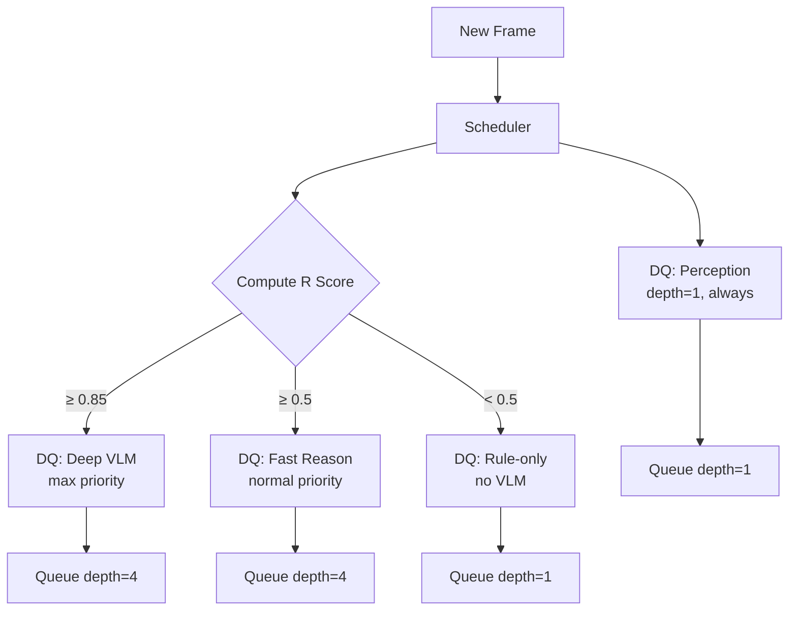

# Multi-Rate Scheduler Architecture

## Purpose

Orchestrate processing across multiple rates — 30 FPS perception, 5-10 Hz fast reasoning, 0.3-0.5 Hz deep VLM reasoning, event-driven forensics. Ensures the real-time path never blocks on slow operations.

---

## Interfaces

### Input

```
SchedulerInput {
  frame:           FrameInput               # new frame arriving
  events:          EventTrigger[]           # events needing processing
  queue_depths:    Map[string, int]         # current depth per queue
  gpu_utilization: float                    # current GPU usage
}
```

### Output

```
SchedulerOutput {
  perception_job:  Job                      # immediate perception work
  async_jobs:      Job[]                    # queued async work
  dropped_jobs:    Job[]                    # jobs dropped due to backpressure
  priority_scores: Map[string, float]       # R scores per event
}

Job {
  id:              string
  type:            Enum                     # PERCEPTION | FAST_REASON | DEEP_VLM | FORENSICS | SUMMARY
  priority:        float                    # 0-1
  deadline_ms:     int                      # when this must complete
  payload:         Map[string, Any]         # job-specific data
  created_at:      uint64
}
```

### API

```
schedule(input: SchedulerInput) -> SchedulerOutput
get_queue_depth(job_type: string) -> int
get_utilization() -> float
```

---

## Data Flow



---

## Data Contracts

### Processing Rates

| Path | Rate | Latency Budget | Queue Depth | Priority |
|---|---|---|---|---|
| Perception (critical) | 30 FPS | 10–20ms | 1 | Highest |
| Fast reasoning | 5–10 Hz | 5–15ms | 4 | High |
| Deep VLM reasoning | 0.3–0.5 Hz | 800–3500ms | 4 | Medium |
| Synthetic forensics | 0.1–1 Hz | 200–2000ms | 8 | Low |
| Long-term summary | 0.05–0.2 Hz | 500–5000ms | 4 | Lowest |

### Priority Scoring (R Score)

```
R = α × prediction_error
  + β × uncertainty
  + γ × model_disagreement
  + δ × event_importance
  + ε × user_priority

α=0.3, β=0.2, γ=0.15, δ=0.25, ε=0.1

R ≥ 0.85 → VLM max priority
R ≥ 0.5 → normal VLM
R < 0.5 → fast-rule only
```

---

## Latency Budget

| Operation | Budget | Notes |
|---|---|---|
| Schedule decision | 0.1–0.3ms | Priority queue operation |
| Queue management | 0.05–0.1ms | Enqueue/dequeue |
| **Total overhead** | **<0.5ms** | |

---

## Dependencies

### Upstream
- `01_perception/` — Perception jobs
- `03_state/04_event_detection.md` — Event-triggered jobs
- `07_scheduler/02_queue_management.md` — Queue state

### Downstream
- All processing components consume scheduled jobs

---

## Reality Check 2026

### NVIDIA RT-VLM (production):
- Chunk-based scheduling: 10-second segments, 80 frames per chunk.
- 51 concurrent alerting streams on H100 at 3.6s avg latency.
- GPU utilization: 94.8% (alerting), 83.8% (captioning).

### TCM-Serve (May 2026):
- Modality-aware: video = "trucks", image = "cars", text = "motorcycles".
- Reduces TTFT by 54% overall, 78.5% for latency-critical requests.

### Design Rules:
1. Perception path is NEVER blocked by VLM queue.
2. VLM queue depth max = 4. Drop oldest if full.
3. Coalesce same-entity events — keep newest, highest R.
4. Every job has a deadline. Expired jobs are dropped, not executed.
