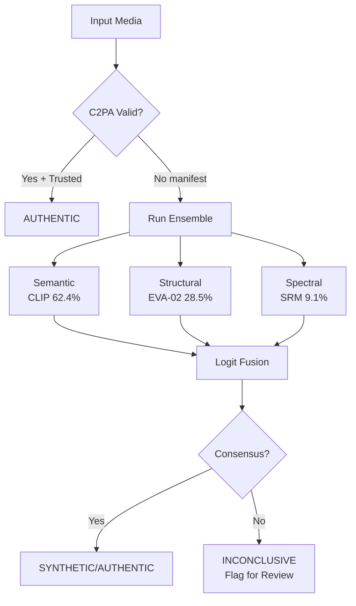

# Deepfake Detection Architecture

## Purpose

Detect synthetic/manipulated media — face swaps, voice clones, AI-generated content, temporal inconsistencies. Uses an ensemble of independent detectors with learned fusion. Event-triggered, not per-frame.

---

## Interfaces

### Input

```
DeepfakeInput {
  media_type:      Enum                     # IMAGE | VIDEO | AUDIO
  content:         Tensor                   # raw media data
  metadata:        MediaMetadata            # codec, resolution, source
  provenance:      ProvenanceData           # C2PA manifest (if available)
}
```

### Output

```
DeepfakeOutput {
  is_synthetic:    bool
  confidence:      float
  detector_scores: Map[string, float]       # per-detector scores
  manipulation_type: string                 # "face_swap" | "voice_clone" | "ai_generated" | "temporal_inconsistency"
  evidence:        string[]                 # detected artifacts
  latency_ms:      float
  ensemble_method: string
}
```

### API

```
detect(input: DeepfakeInput, config: DeepfakeConfig) -> DeepfakeOutput
detect_ensemble(inputs: DeepfakeInput[]) -> DeepfakeOutput[]
```

---

## Data Flow



---

## Data Contracts

### Detector Ensemble (from RA-Bench 2026)

| Detector | Type | Public Ref AUC | RA-Bench AUC (Open) |
|---|---|---|---|
| CNNSpot | Spatial | 81.4 | 39.2 |
| NPR | Spatial | 67.6 | 54.6 |
| ForgeLens | Multi | 92.9 | 64.9 |
| DeCoF | Temporal | 81.5 | 63.4 |
| ReStraV | Multi | 98.6 | 58.1 |
| **7-detector mean** | | **84.2** | **54.6** |

### Ensemble Design (from TRIDENT/LOGER 2026):

```
1. Semantic branch: CLIP/SigLIP embeddings
2. Structural branch: EVA-02 features
3. Spectral branch: SRM/Bayar-constrained filters
4. Fusion: Logit-space averaging with rank-based normalization
5. Weight: Semantic 62.4%, Structural 28.5%, Spectral 9.1%
```

### Configuration

```
DeepfakeConfig {
  detectors:       string[]                 # ["CNNSpot", "ForgeLens", "DeCoF", "ReStraV"]
  ensemble_method: string                   # "logit_average" | "rank_normalize" | "learned"
  confidence_threshold: float               # default 0.7
  use_provenance:  bool                     # check C2PA first
  max_latency_ms:  int                      # default 2000
}
```

---

## Latency Budget

| Stage | Budget | Notes |
|---|---|---|
| C2PA provenance check | 50–200ms | If available |
| Per-detector inference | 50–500ms each | Depends on model |
| Ensemble fusion | 5–10ms | Logit averaging |
| **Total (ensemble)** | **200–2000ms** | Async |

---

## Dependencies

### Upstream
- `08_forensics/02_provenance_c2pa.md` — Provenance check
- `01_perception/04_segmentation.md` — Face regions (optional)

### Downstream
- `06_calibration/04_claim_output.md` — Authenticity claims
- `04_memory/04_episodic_memory.md` — Forensic results

---

## Reality Check 2026

### RA-Bench Critical Finding:
- **No detector generalizes across all generators.** 26 of 63 detector-source pairs have AUC <50%.
- Public-reference rankings do NOT transfer (Spearman ρ = 0.26).
- At 5% FPR, 7-detector mean identifies only 6.0-7.5% of generated videos.
- Social dissemination: fine-tuned MLLMs drop from 46.0% → 1.4% FakeR after re-encoding.

### Cross-Dataset Collapse:
- XceptionNet: 99.26% in-distribution (FF++) → 51.31% cross-dataset (DFDC), fake recall 13.16%.
- Transformers show 11.33% less decline than CNNs in cross-dataset settings.

### Audio Deepfake:
- Resemble AI: 98.1% accuracy, 0.33 RTF (in-domain).
- After AFE pipeline: AASIST degrades from 0.83% EER to 47.11%.
- **Cascaded distortion is the real enemy, not individual attacks.**

### Design Rules:
1. **Never rely on single detectors.** Ensemble 4-6 diverse models.
2. **Test under social dissemination.** Compression, resizing, frame rate reduction.
3. **Treat as triage, not adjudication.** Flag for human review, don't auto-decide.
4. **Check provenance first.** C2PA/SynthID before running detectors.
