# System Architecture Diagrams

> All diagrams use Mermaid syntax. Render in GitHub, VS Code (with Mermaid extension), or any Mermaid-compatible viewer.

## Diagram Files

| File | Diagrams | What's Inside |
|------|----------|---------------|
| **`00_system_diagrams.md`** | 15 | System overview, critical path, perception, fusion, state, memory, reasoning, calibration, scheduler, forensics, data flow, hardware tiers, entity state machine, hypothesis decision tree |
| **`01_db_schema_diagrams.md`** | 15 | Entity store, event store, claim store, hypothesis store, evidence graph, calibration store, entity profiles, event summaries, episodes, forensic results, config store, ring buffers, complete ER diagram, index strategy, data lifecycle |
| **`02_api_protobuf_diagrams.md`** | 10 | Protobuf hierarchy, FrameObservationBatch, WorldStateSnapshot, Claim schemas, API endpoints, NvSchema flow, C2PA manifest, SynthID flow, FlatBuffers vs Protobuf, schema versioning |
| **`03_complete_reference.md`** | 3 | Master reference (all layers + all stores), latency budget summary, storage estimates |
| **`04_master_architecture.md`** | 7 | Complete system architecture (all layers all connections), end-to-end data flow, complete I/O flow, all data paths (6 paths A-F), component interaction map, full system latency budgets, system topology (tier 1-3) |
| **`05_complete_system.md`** | 10 | Complete pipeline (every data path), entity lifecycle state machine, hypothesis decision tree, evidence graph structure, data buffers & flows, API endpoints with contracts, deployment topology (K8s), latency budget frame-to-claim, component integration matrix, system summary (all components, stores, schemas, latency, hardware, deployment) |

---

## 1. System Overview — All Layers

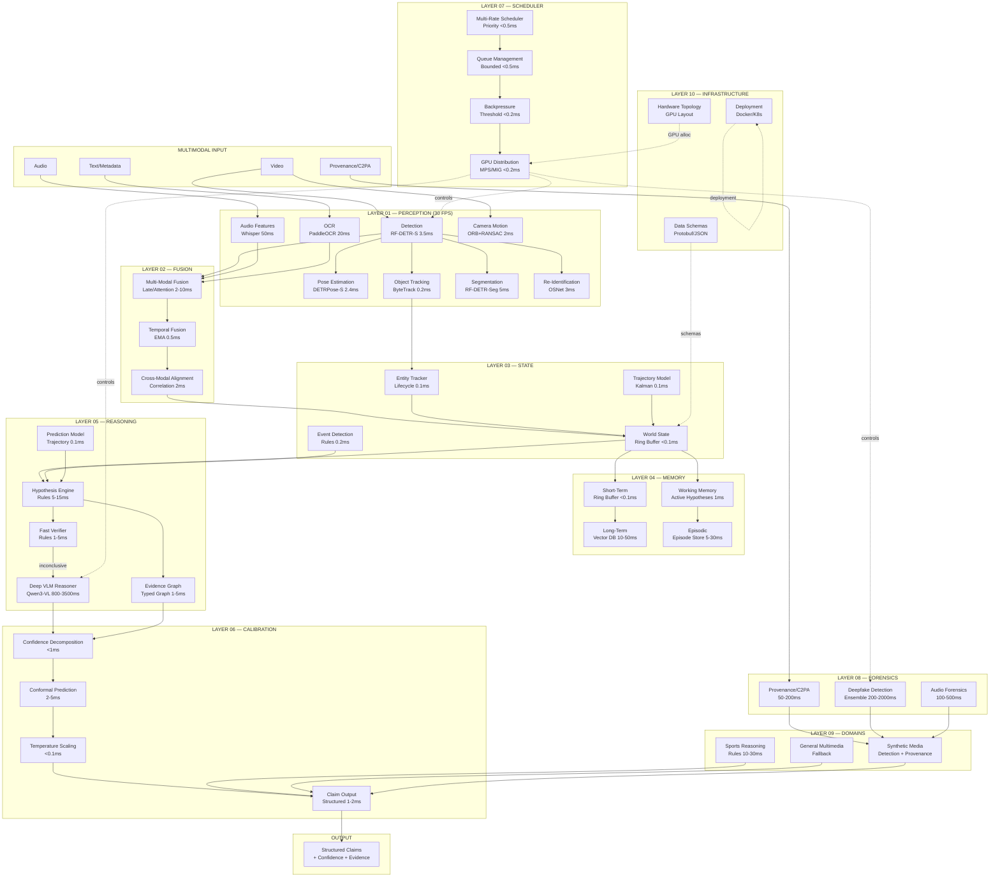

---

## 2. Critical Path — 30 FPS Data Flow

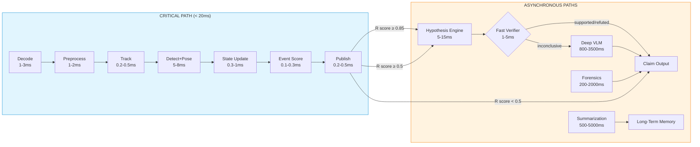

---

## 3. Layer 01 — Perception Detail

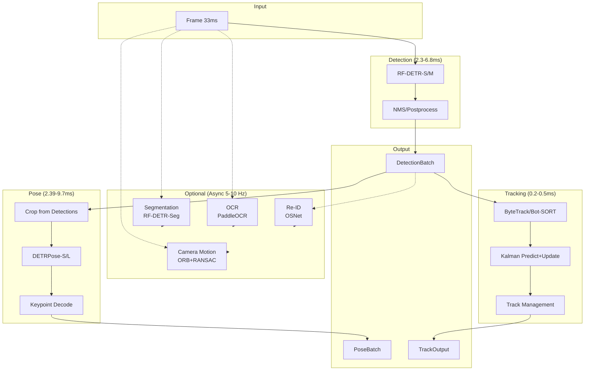

---

## 4. Layer 02 — Fusion Detail

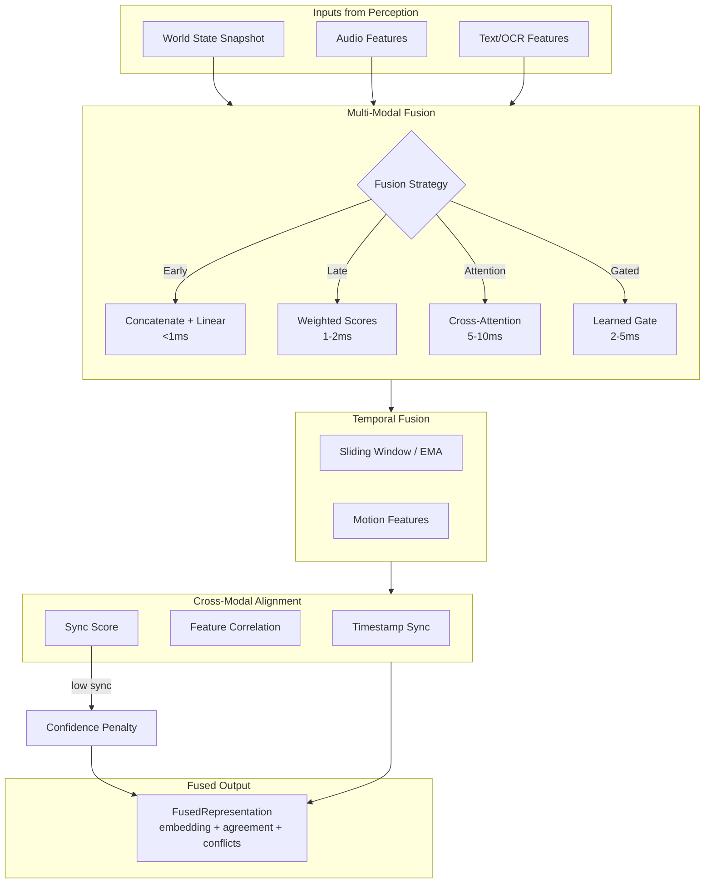

---

## 5. Layer 03 — State Management

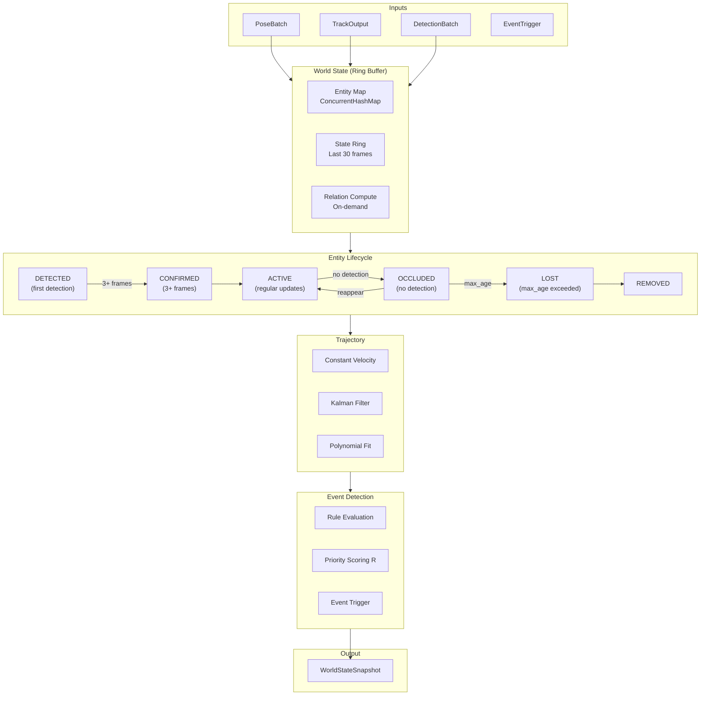

---

## 6. Layer 04 — Memory Hierarchy

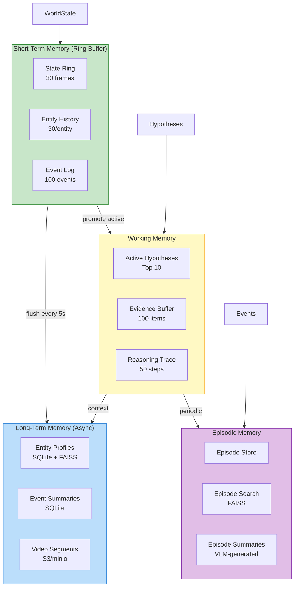

---

## 7. Layer 05 — Reasoning Pipeline

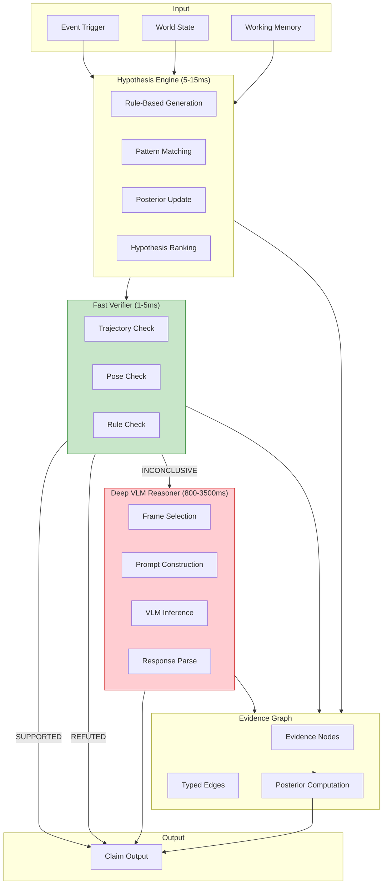

---

## 8. Layer 06 — Calibration Flow

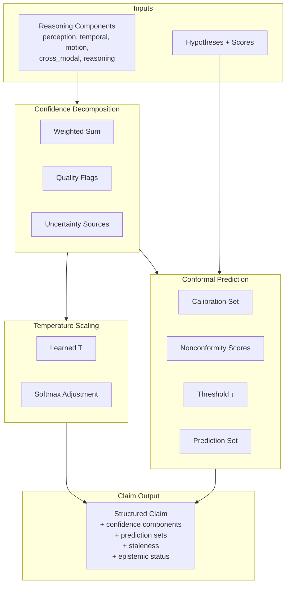

---

## 9. Layer 07 — Scheduler & Backpressure

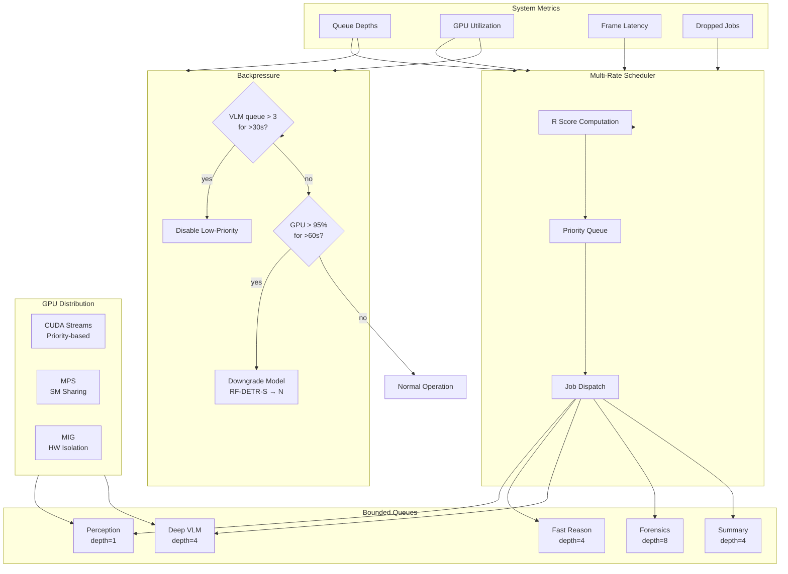

---

## 10. Layer 08 — Forensics Pipeline

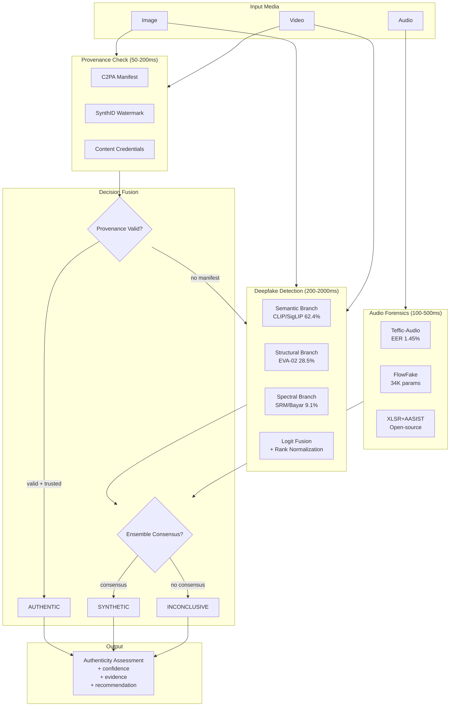

---

## 11. Full Data Flow — End to End

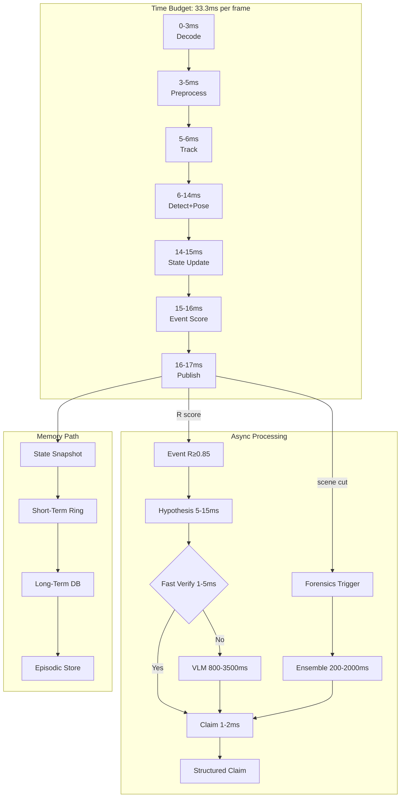

---

## 12. Hardware Topology — Tier 1 (1× RTX 4090)

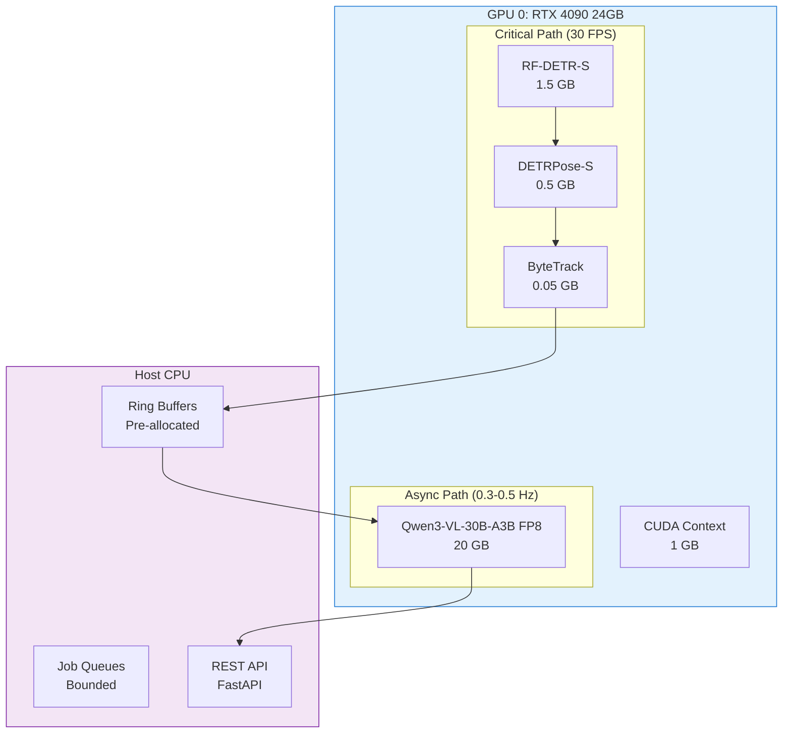

---

## 13. Hardware Topology — Tier 3 (Multi-GPU)

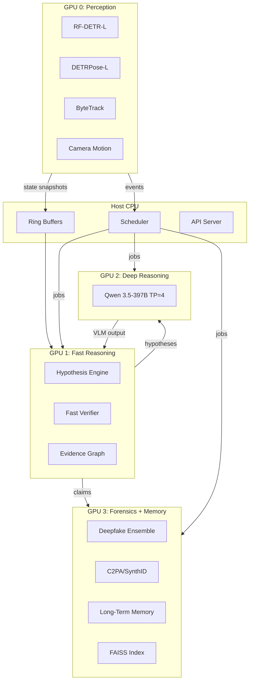

---

## 14. State Machine — Entity Lifecycle

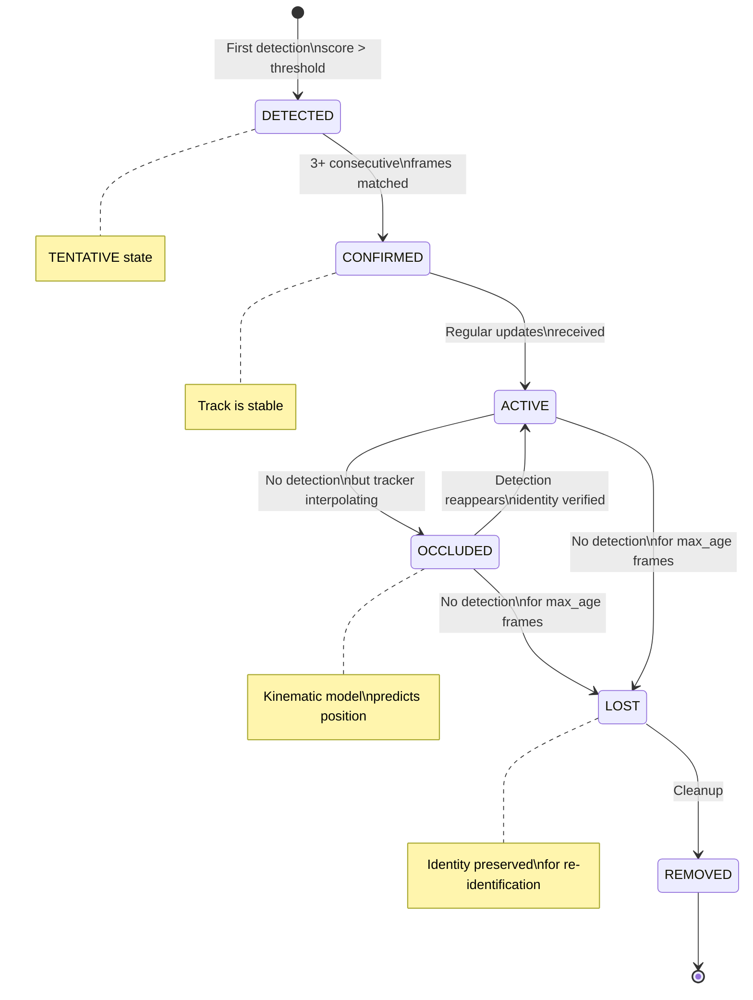

---

## 15. Hypothesis Decision Tree

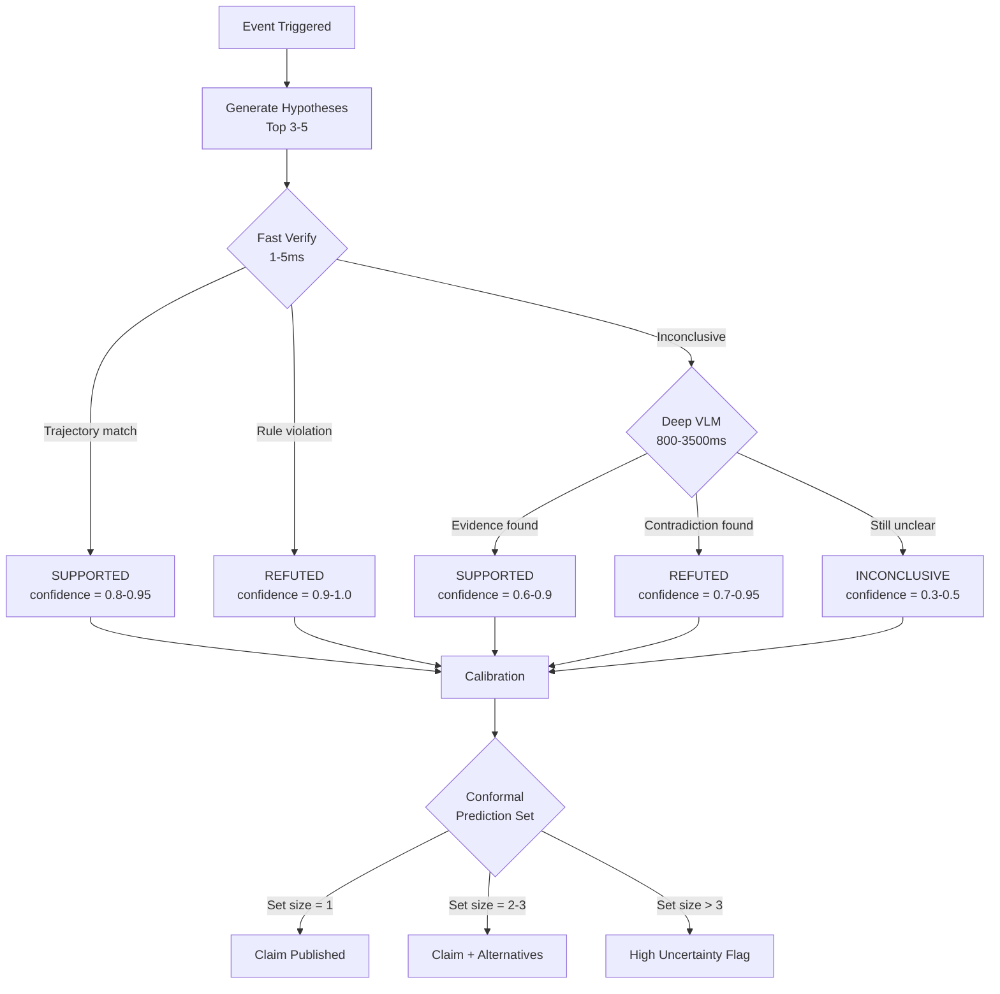
