# Database Schema Diagrams

> All schemas use Mermaid ER diagram syntax. Covers every data store in the system.

---

## 1. Entity Store (SQLite — Primary Entity Database)

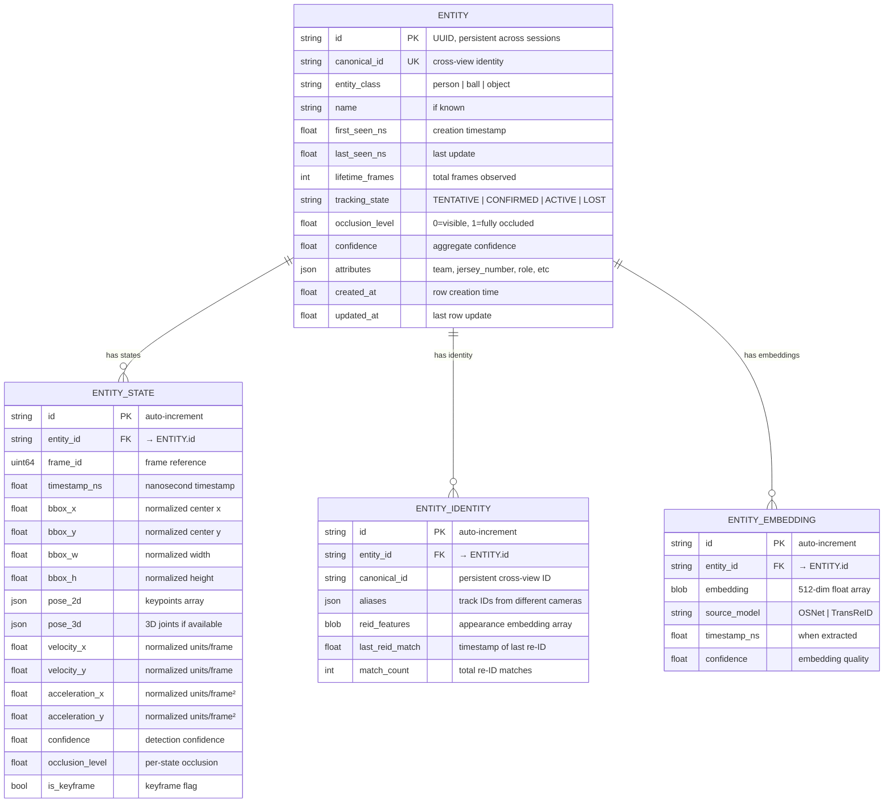

---

## 2. Event Store (SQLite — Event Database)

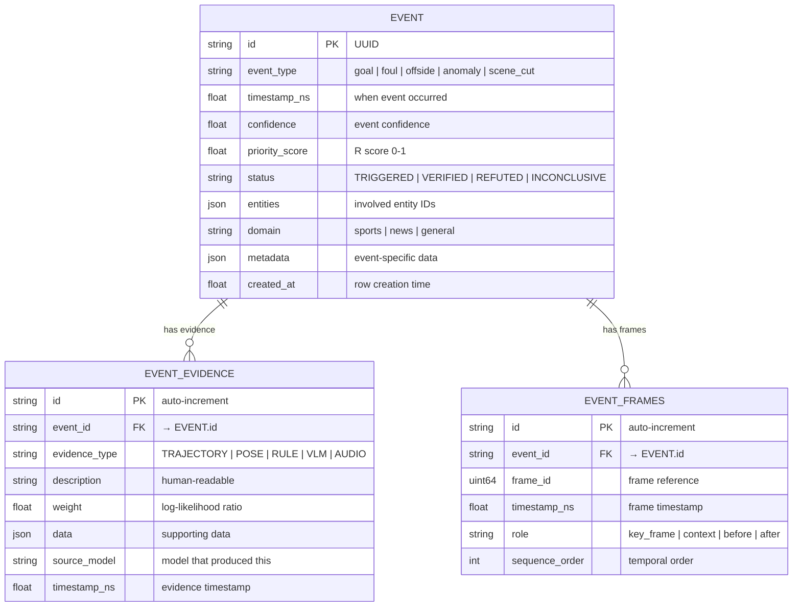

---

## 3. Claim Store (SQLite — Final Claims)

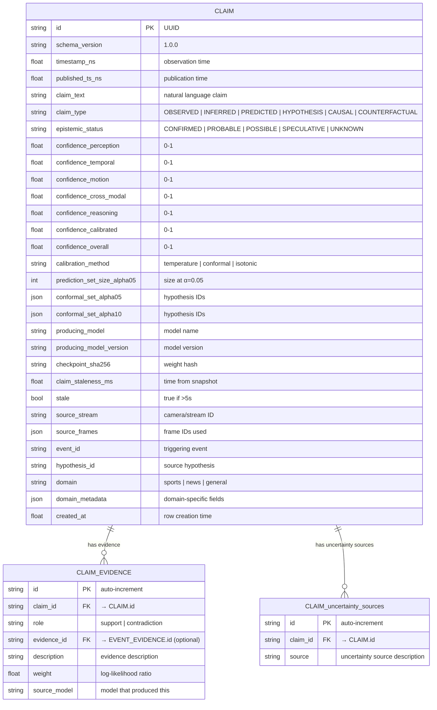

---

## 4. Hypothesis Store (In-Memory — Working Memory)

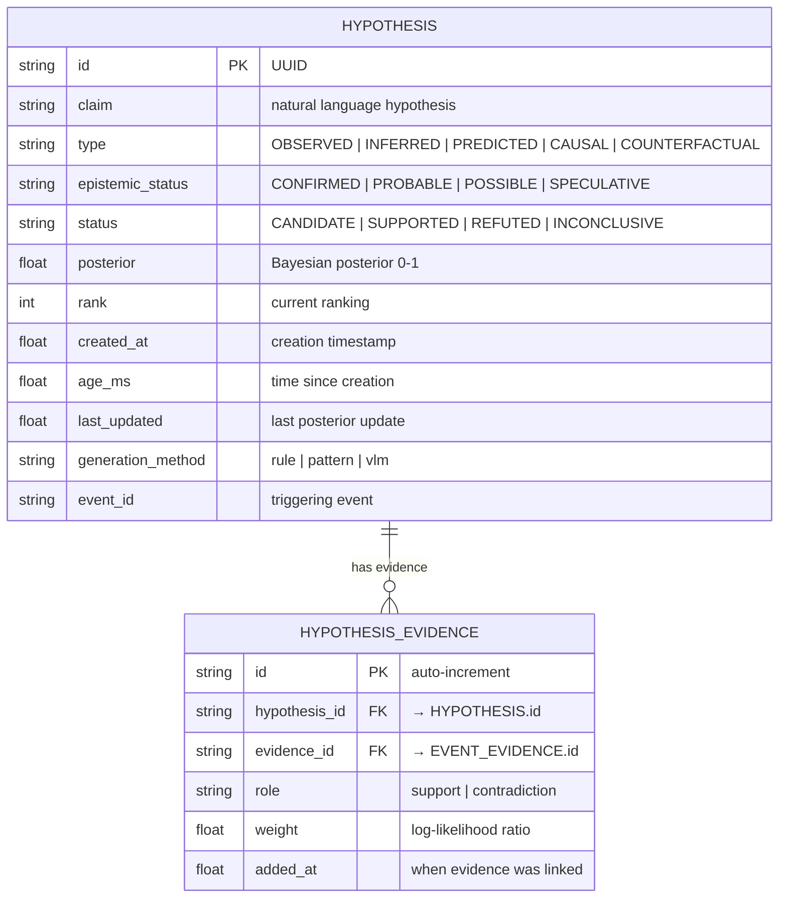

---

## 5. Evidence Graph (In-Memory — Graph Structure)

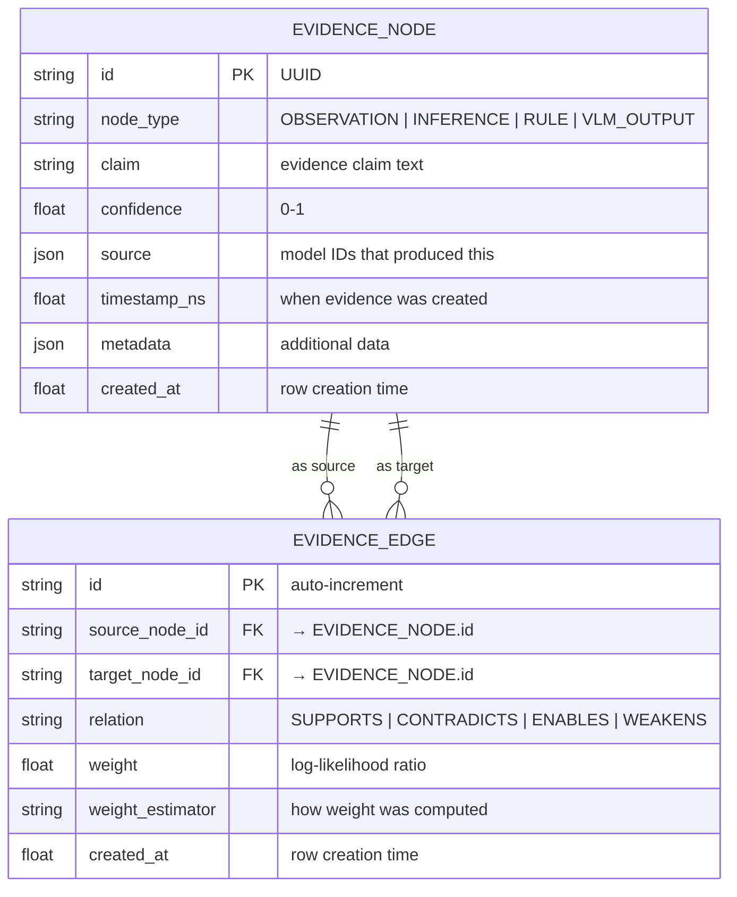

---

## 6. Calibration Store (SQLite — Calibration Data)

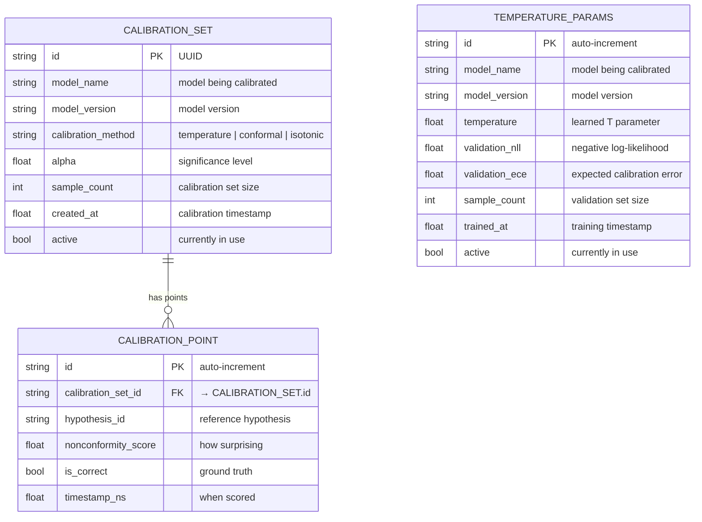

---

## 7. Long-Term Entity Profiles (SQLite + FAISS)

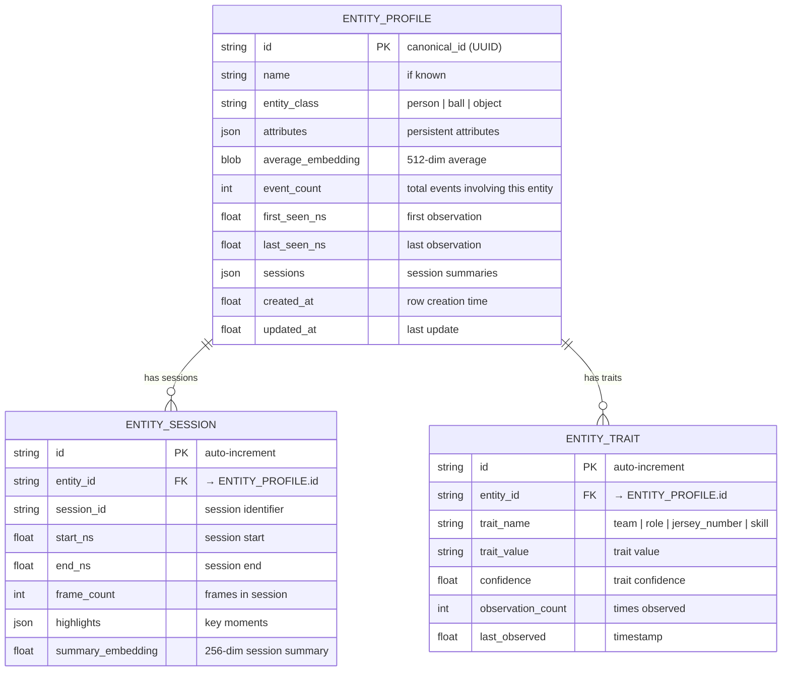

---

## 8. Event Summary Store (SQLite — Event Summaries)

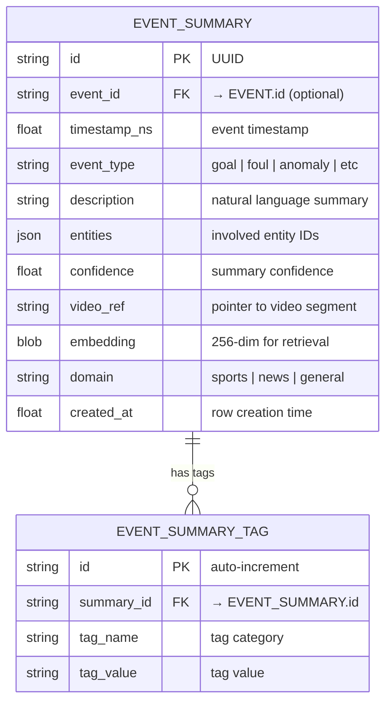

---

## 9. Episode Store (SQLite — Episodic Memory)

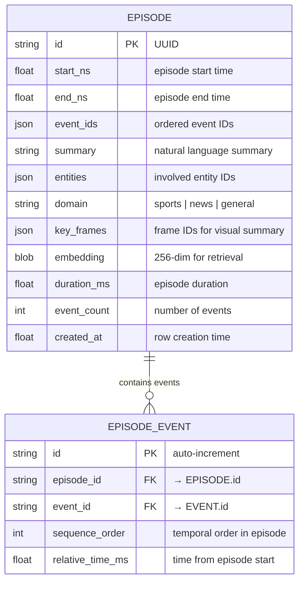

---

## 10. Forensic Results Store (SQLite)

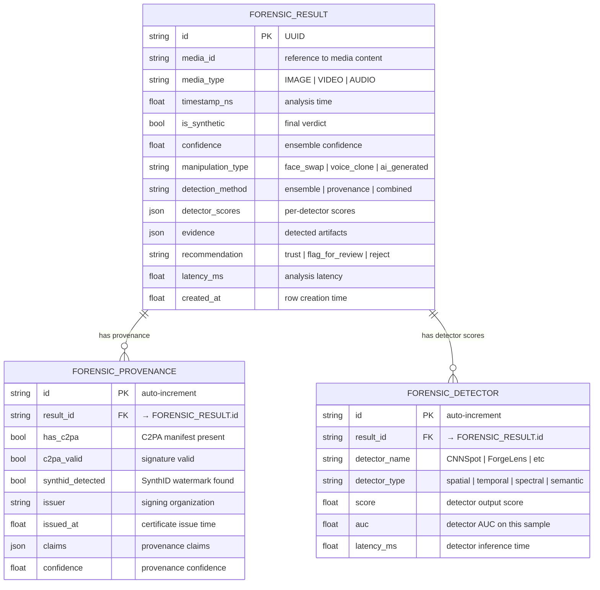

---

## 11. Configuration Store (JSON/SQLite)

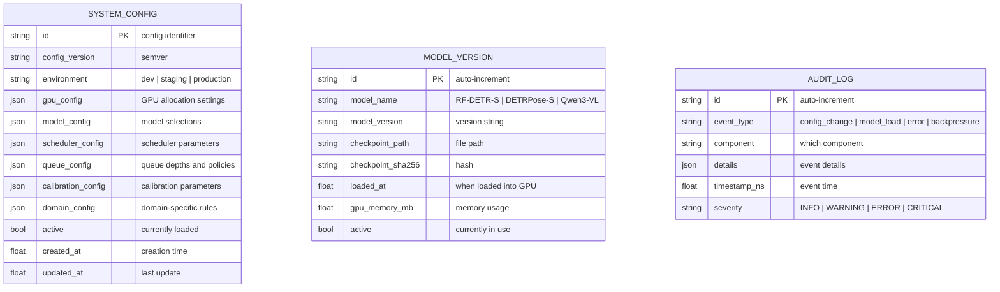

---

## 12. Ring Buffer Schema (In-Memory — Not SQLite)

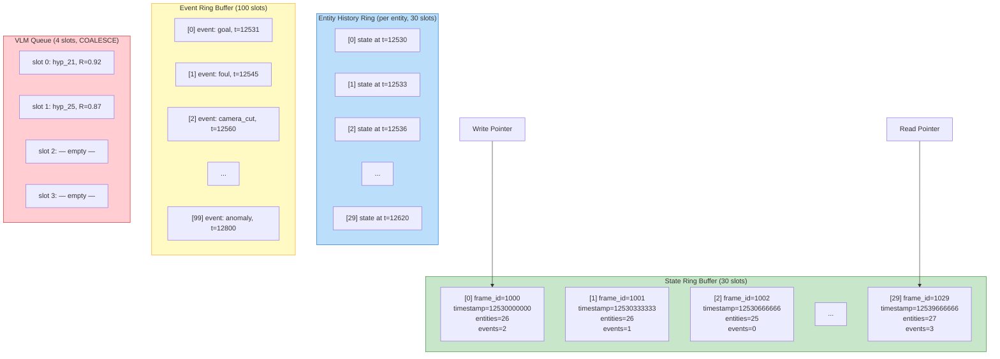

---

## 13. Complete Entity Relationship Diagram

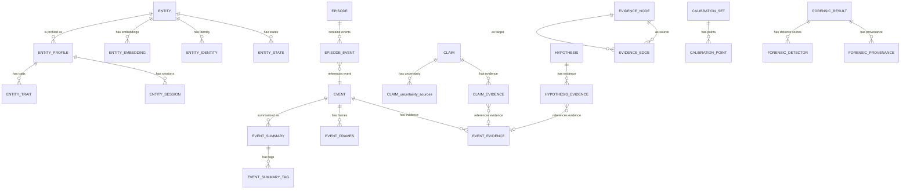

---

## 14. Index Strategy

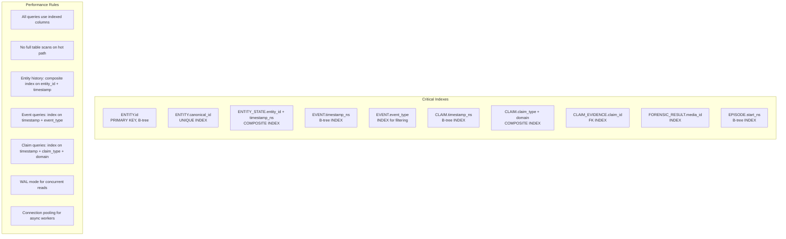

---

## 15. Data Lifecycle Diagram

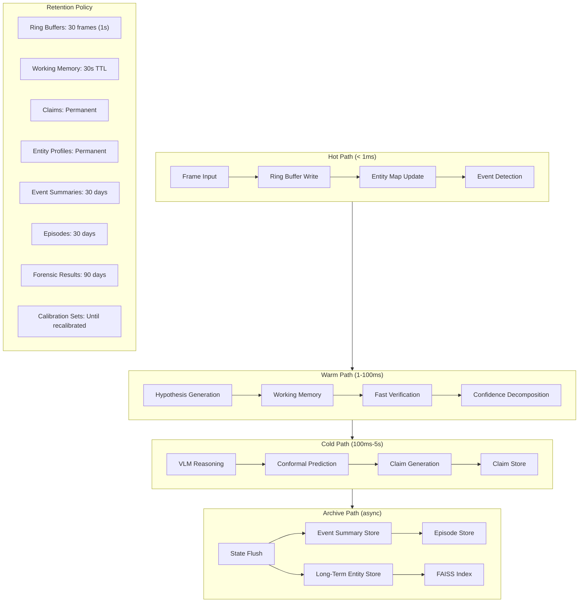
