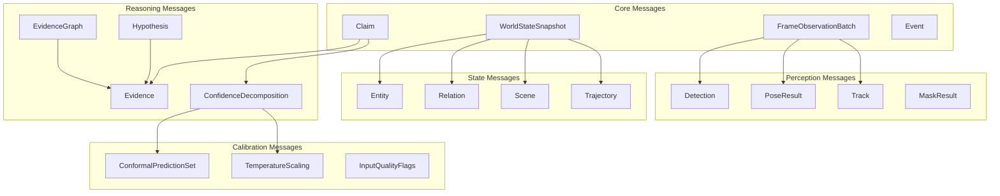
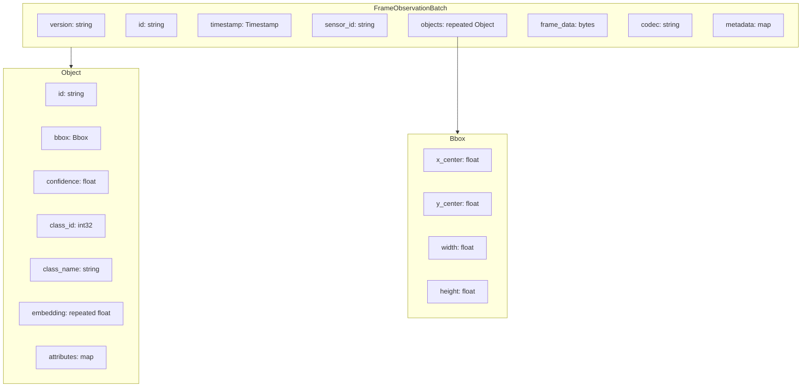
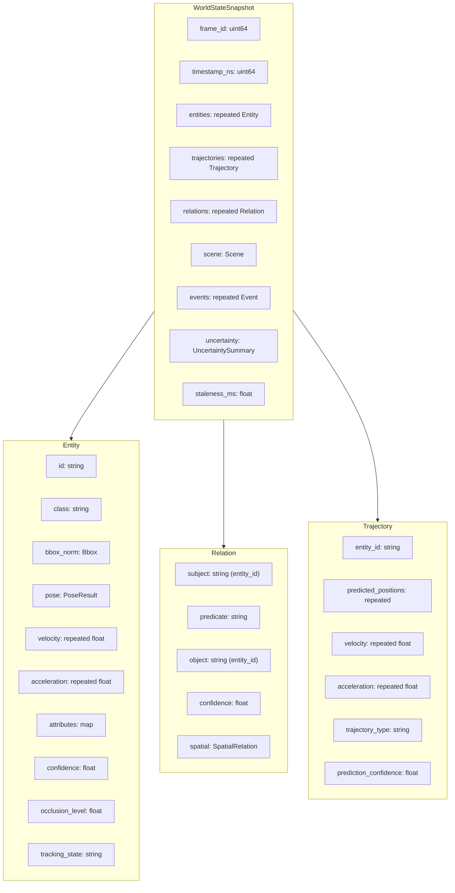
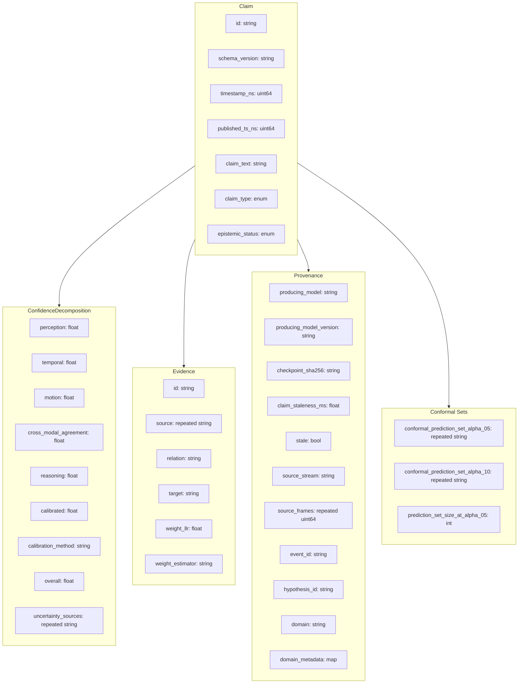
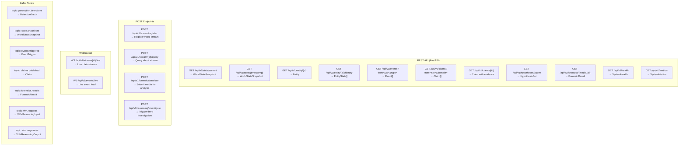
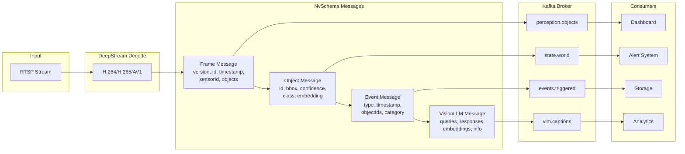
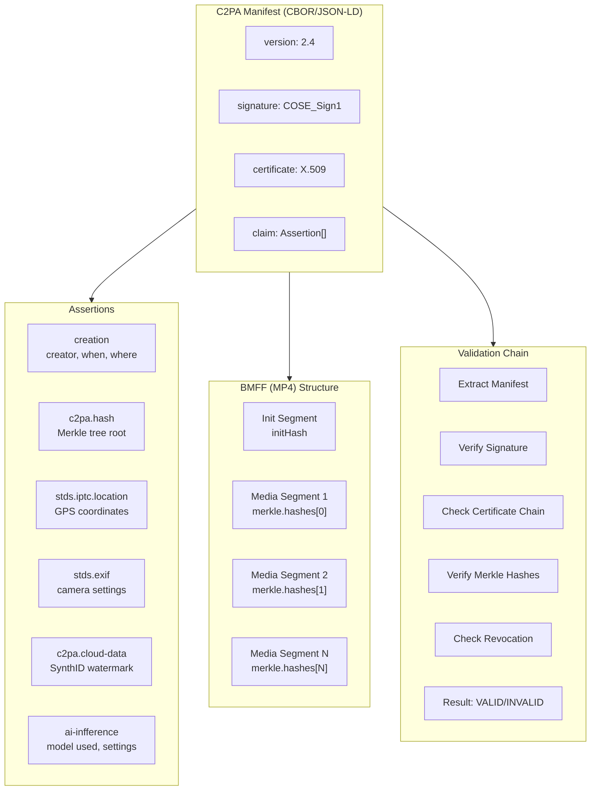
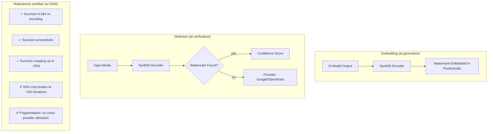
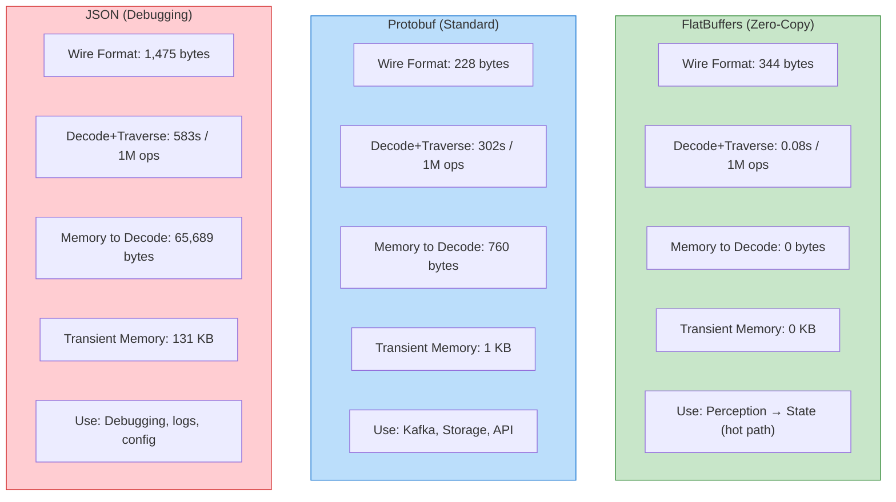
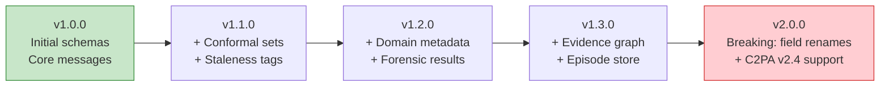

# API & Protobuf Schema Diagrams

> Visual representations of all message formats, API endpoints, and serialization schemas.

---

## 1. Protobuf Message Hierarchy

---

## 2. FrameObservationBatch — Detailed Schema

---

## 3. WorldStateSnapshot — Detailed Schema

---

## 4. Claim — Detailed Schema

---

## 5. API Endpoint Map

---

## 6. NvSchema Message Flow (NVIDIA Compatible)

---

## 7. C2PA Manifest Structure

---

## 8. SynthID Watermark Flow

---

## 9. FlatBuffers vs Protobuf Comparison

---

## 10. Schema Versioning Timeline

