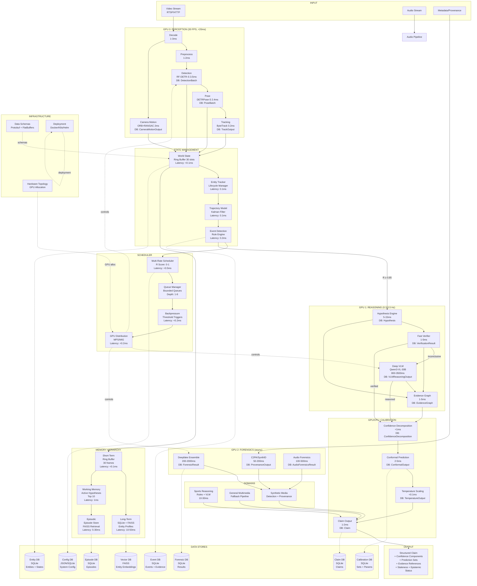
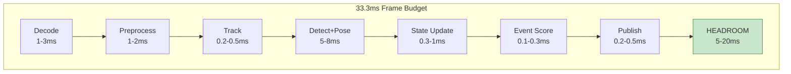
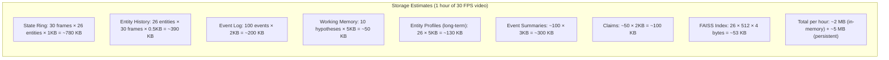

# Complete System Reference Diagram

> Master diagram showing every component, every data store, every connection, and every latency budget.

---

## Full System — All Layers + All Data Stores

---

## Latency Budget Summary

---

## Data Store Size Estimates

