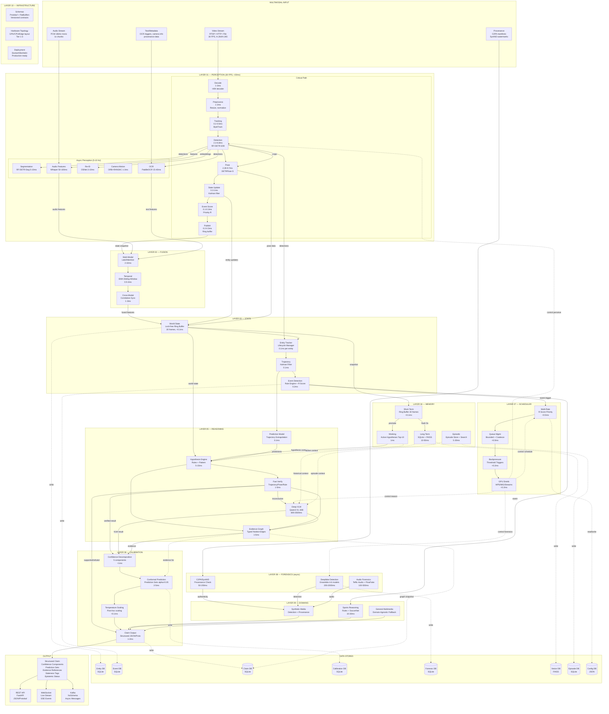
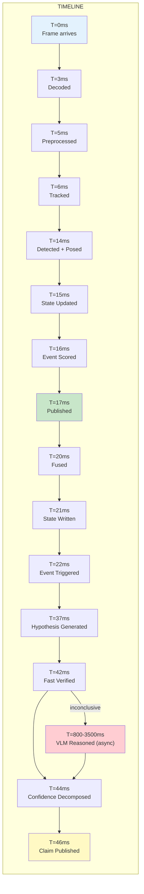
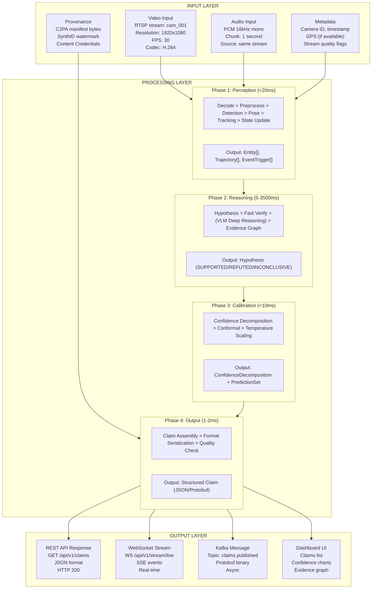
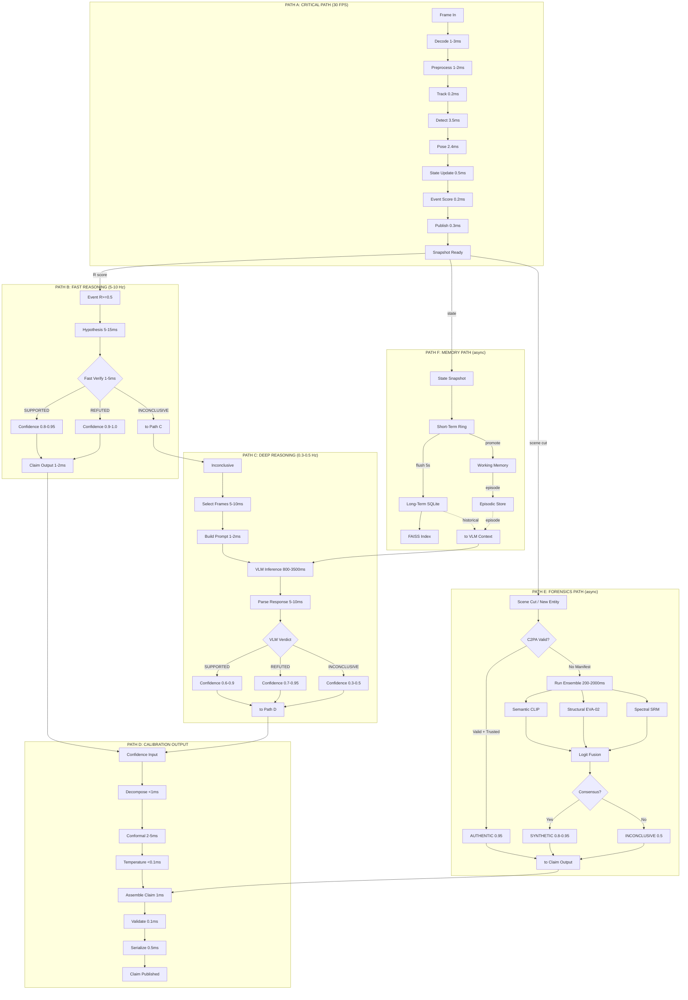
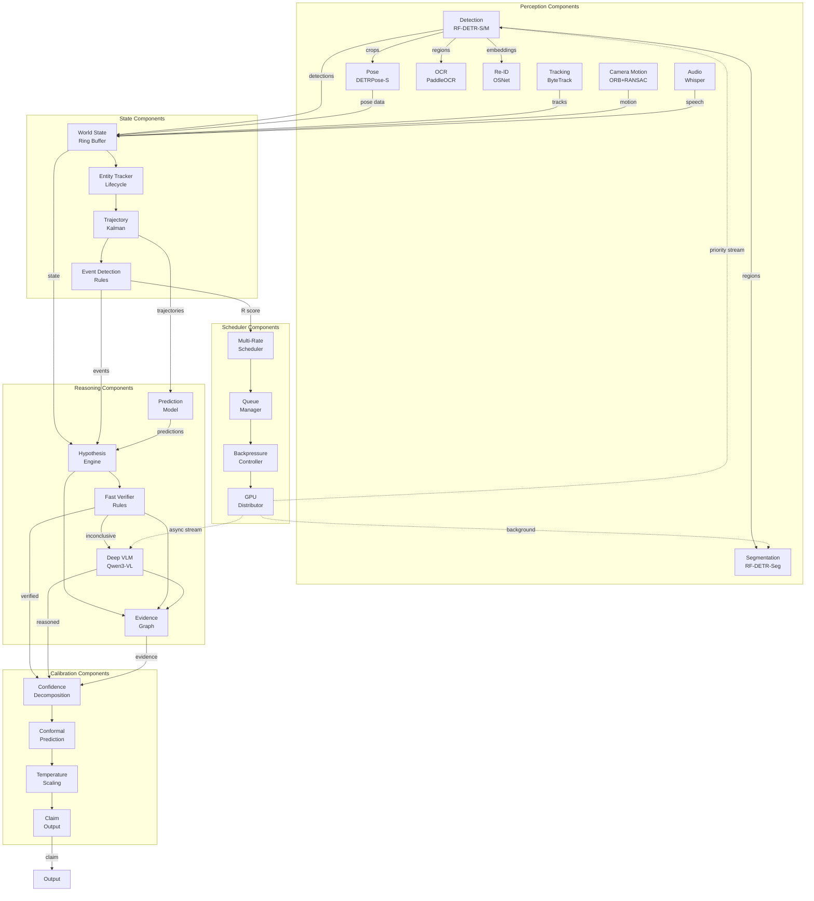
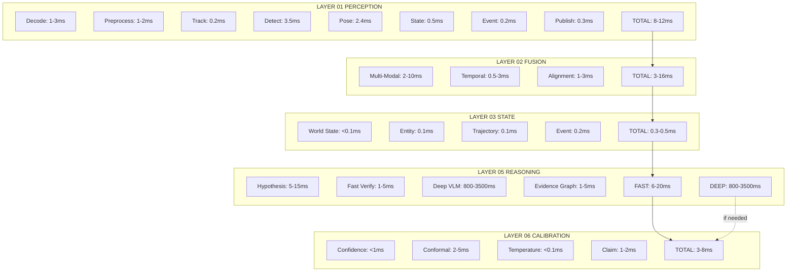
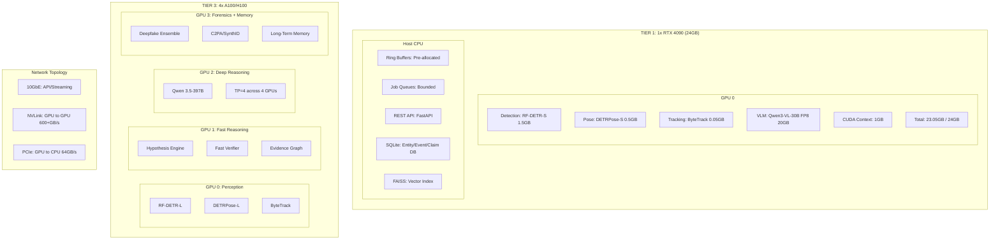

# Master Architecture — Complete System View

> Every component, every connection, every data path, every latency budget. One diagram to see the whole system.

---

## 1. Complete System Architecture — All Layers, All Connections

---

## 2. End-to-End Data Flow — Input to Output

---

## 3. Complete Input/Output Flow

---

## 4. Complete Data Flow — All Paths

---

## 5. Complete Component Interaction Map

---

## 6. Full System with Latency Budgets

---

## 7. System Topology — Physical Layout

