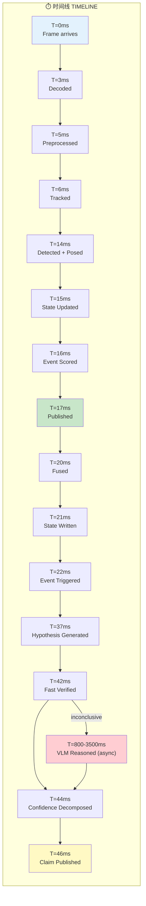

# Master Architecture — Complete System View

> Every component, every connection, every data path, every latency budget. One diagram to see the whole system.

---

## 1. Complete System Architecture — All Layers, All Connections

```mermaid
graph TB
    subgraph ╔══════════════════════════════════════════════════════════════╗
        direction TB
        subgraph INPUT["多媒体输入 MULTIMODAL INPUT"]
            V["📹 视频流 Video Stream<br/>RTSP / HTTP / File<br/>30 FPS, H.264/H.265"]
            A["🔊 音频流 Audio Stream<br/>PCM 16kHz mono<br/>1s chunks"]
            T["📝 文本/元数据 Text/Metadata<br/>OCR triggers, camera info<br/>provenance data"]
            P["🔒 来源验证 Provenance<br/>C2PA manifests<br/>SynthID watermarks"]
        end
    end

    subgraph ╔══════════════════════════════════════════════════════════════╗
        direction TB
        subgraph PERCEPTION["LAYER 01 — 感知层 PERCEPTION (30 FPS, <20ms)"]
            direction LR
            subgraph CRITICAL["⚡ 关键路径 Critical Path"]
                D1["解码 Decode<br/>1-3ms<br/>H/W decoder"] --> D2["预处理 Preprocess<br/>1-2ms<br/>Resize, normalize"]
                D2 --> D3["跟踪 Tracking<br/>0.2-0.5ms<br/>ByteTrack"]
                D3 --> D4["检测 Detection<br/>2.3-6.8ms<br/>RF-DETR-S/M"]
                D4 --> D5["姿态 Pose<br/>2.39-9.7ms<br/>DETRPose-S"]
                D5 --> D6["状态更新 State Update<br/>0.3-1ms<br/>Kalman filter"]
                D6 --> D7["事件评分 Event Score<br/>0.1-0.3ms<br/>Priority R"]
                D7 --> D8["发布 Publish<br/>0.2-0.5ms<br/>Ring buffer"]
            end
            subgraph ASYNC_PERC["🔄 异步感知 Async Perception (5-10 Hz)"]
                O1["分割 Segmentation<br/>RF-DETR-Seg 5-10ms"]
                O2["OCR文字识别<br/>PaddleOCR 15-40ms"]
                O3["重识别 Re-ID<br/>OSNet 3-10ms"]
                O4["相机运动 Camera Motion<br/>ORB+RANSAC 1-3ms"]
                O5["音频特征 Audio Features<br/>Whisper 50-100ms"]
            end
        end
    end

    subgraph ╔══════════════════════════════════════════════════════════════╗
        direction TB
        subgraph FUSION["LAYER 02 — 融合层 FUSION"]
            direction LR
            F1["多模态融合 Multi-Modal<br/>Late/Attention<br/>2-10ms"]
            F2["时间融合 Temporal<br/>EMA Sliding Window<br/>0.5-3ms"]
            F3["跨模态对齐 Cross-Modal<br/>Correlation Sync<br/>1-3ms"]
        end
    end

    subgraph ╔══════════════════════════════════════════════════════════════╗
        direction TB
        subgraph STATE["LAYER 03 — 状态层 STATE"]
            direction LR
            S1["🌍 世界状态 World State<br/>Lock-free Ring Buffer<br/>30 frames, <0.1ms"]
            S2["👤 实体追踪 Entity Tracker<br/>Lifecycle Manager<br/>0.1ms per entity"]
            S3["📈 轨迹模型 Trajectory<br/>Kalman Filter<br/>0.1ms"]
            S4["⚡ 事件检测 Event Detection<br/>Rule Engine + R Score<br/>0.2ms"]
        end
    end

    subgraph ╔══════════════════════════════════════════════════════════════╗
        direction TB
        subgraph MEMORY["LAYER 04 — 记忆层 MEMORY"]
            direction LR
            M1["💾 短期记忆 Short-Term<br/>Ring Buffer 30 frames<br/><0.1ms"]
            M2["🧠 工作记忆 Working<br/>Active Hypotheses Top-10<br/>1ms"]
            M3["📚 长期记忆 Long-Term<br/>SQLite + FAISS<br/>10-50ms"]
            M4["📖 情景记忆 Episodic<br/>Episode Store + Search<br/>5-30ms"]
        end
    end

    subgraph ╔══════════════════════════════════════════════════════════════╗
        direction TB
        subgraph REASONING["LAYER 05 — 推理层 REASONING"]
            direction LR
            R1["🔮 假设引擎 Hypothesis<br/>Rules + Pattern<br/>5-15ms"]
            R2["✅ 快速验证 Fast Verify<br/>Trajectory/Pose/Rule<br/>1-5ms"]
            R3["深度VLM推理 Deep VLM<br/>Qwen3-VL-30B<br/>800-3500ms"]
            R4["🔗 证据图 Evidence Graph<br/>Typed Nodes+Edges<br/>1-5ms"]
            R5["🔮 预测模型 Prediction<br/>Trajectory Extrapolation<br/>0.1ms"]
        end
    end

    subgraph ╔══════════════════════════════════════════════════════════════╗
        direction TB
        subgraph CALIBRATION["LAYER 06 — 校准层 CALIBRATION"]
            direction LR
            C1["📊 置信度分解 Confidence<br/>5 components<br/><1ms"]
            C2["📏 保形预测 Conformal<br/>Prediction Sets α=0.05<br/>2-5ms"]
            C3["🌡️ 温度缩放 Temperature<br/>Post-hoc scaling<br/><0.1ms"]
            C4["📋 声明输出 Claim Output<br/>Structured JSON/Proto<br/>1-2ms"]
        end
    end

    subgraph ╔══════════════════════════════════════════════════════════════╗
        direction TB
        subgraph SCHEDULER["LAYER 07 — 调度层 SCHEDULER"]
            direction LR
            Q1["📅 多速率调度 Multi-Rate<br/>R Score Priority<br/><0.5ms"]
            Q2["📦 队列管理 Queue Mgmt<br/>Bounded + Coalesce<br/><0.5ms"]
            Q3["🚨 背压控制 Backpressure<br/>Threshold Triggers<br/><0.2ms"]
            Q4["🖥️ GPU分配 GPU Distrib<br/>MPS/MIG/Streams<br/><0.2ms"]
        end
    end

    subgraph ╔══════════════════════════════════════════════════════════════╗
        direction TB
        subgraph FORENSICS["LAYER 08 — 取证层 FORENSICS (async)"]
            direction LR
            K1["🔍 深度伪造检测 Deepfake<br/>Ensemble 4-6 models<br/>200-2000ms"]
            K2["🔒 来源验证 C2PA/SynthID<br/>Provenance Check<br/>50-200ms"]
            K3["🔊 音频取证 Audio<br/>Teffic-Audio + FlowFake<br/>100-500ms"]
        end
    end

    subgraph ╔══════════════════════════════════════════════════════════════╗
        direction TB
        subgraph DOMAINS["LAYER 09 — 领域层 DOMAINS"]
            direction LR
            N1["⚽ 体育推理 Sports<br/>Rules + SoccerNet<br/>10-30ms"]
            N2["📺 通用多媒体 General<br/>Domain-Agnostic Fallback"]
            N3["🤖 合成媒体 Synthetic<br/>Detection + Provenance"]
        end
    end

    subgraph ╔══════════════════════════════════════════════════════════════╗
        direction TB
        subgraph INFRA["LAYER 10 — 基础设施 INFRASTRUCTURE"]
            direction LR
            I1["📐 数据模式 Schemas<br/>Protobuf + FlatBuffers<br/>Versioned contracts"]
            I2["🖥️ 硬件拓扑 Hardware<br/>GPU/CPU/Edge layout<br/>Tier 1-3"]
            I3["🚀 部署 Deployment<br/>Docker/K8s/Helm<br/>Production-ready"]
        end
    end

    subgraph ╔══════════════════════════════════════════════════════════════╗
        direction TB
        subgraph STORES["数据存储 DATA STORES"]
            direction LR
            DB1[("🗂️ 实体库 Entity DB<br/>SQLite<br/>Entities + States")]
            DB2[("📊 事件库 Event DB<br/>SQLite<br/>Events + Evidence")]
            DB3[("📋 声明库 Claim DB<br/>SQLite<br/>Claims + Confidence")]
            DB4[("📏 校准库 Calibration DB<br/>SQLite<br/>Sets + Params")]
            DB5[("🔍 取证库 Forensic DB<br/>SQLite<br/>Results")]
            DB6[("🔢 向量库 Vector DB<br/>FAISS<br/>Embeddings")]
            DB7[("📖 情景库 Episode DB<br/>SQLite<br/>Episodes")]
            DB8[("⚙️ 配置库 Config DB<br/>JSON<br/>System Config")]
        end
    end

    subgraph ╔══════════════════════════════════════════════════════════════╗
        direction TB
        subgraph OUTPUT["输出 OUTPUT"]
            O_CLAIM["📋 结构化声明 Structured Claim<br/>+ 置信度分解 Confidence Components<br/>+ 保形预测集 Prediction Sets<br/>+ 证据引用 Evidence References<br/>+ 陈旧度标记 Staleness Tags<br/>+ 认识状态 Epistemic Status"]
            O_API["🌐 REST API<br/>FastAPI<br/>JSON/Protobuf"]
            O_WS["📡 WebSocket<br/>Live Stream<br/>SSE Events"]
            O_KFK["📨 Kafka<br/>NvSchema<br/>Async Messages"]
        end
    end

    %% ═══════════════════════════════════════════════════════════
    %% INPUT CONNECTIONS
    %% ═══════════════════════════════════════════════════════════
    V --> D1
    A --> O5
    T --> O2
    P --> K2

    %% ═══════════════════════════════════════════════════════════
    %% PERCEPTION INTERNAL
    %% ═══════════════════════════════════════════════════════════
    D4 -->|crops| D5
    D4 -->|detections| O1
    D4 -->|detections| O2
    D4 -->|embeddings| O3
    D4 -->|features| O5

    %% ═══════════════════════════════════════════════════════════
    %% PERCEPTION → FUSION
    %% ═══════════════════════════════════════════════════════════
    D8 -->|state snapshot| F1
    O5 -->|audio features| F1
    O2 -->|text features| F1

    %% ═══════════════════════════════════════════════════════════
    %% FUSION → STATE
    %% ═══════════════════════════════════════════════════════════
    F1 --> F2
    F2 --> F3
    F3 -->|fused features| S1

    %% ═══════════════════════════════════════════════════════════
    %% STATE INTERNAL
    %% ═══════════════════════════════════════════════════════════
    D6 -->|entity updates| S1
    D5 -->|pose data| S1
    D4 -->|detections| S2
    S1 --> S2
    S2 --> S3
    S3 --> S4

    %% ═══════════════════════════════════════════════════════════
    %% STATE → MEMORY
    %% ═══════════════════════════════════════════════════════════
    S1 -->|snapshot| M1
    M1 -->|flush 5s| M3
    M1 -->|promote| M2

    %% ═══════════════════════════════════════════════════════════
    %% STATE → REASONING
    %% ═══════════════════════════════════════════════════════════
    S4 -->|event trigger| Q1
    S1 -->|world state| R1
    M2 -->|hypothesis context| R1

    %% ═══════════════════════════════════════════════════════════
    %% REASONING INTERNAL
    %% ═══════════════════════════════════════════════════════════
    R1 --> R2
    R2 -->|supported/refuted| C4
    R2 -->|inconclusive| R3
    R1 --> R4
    R2 --> R4
    R3 --> R4
    S3 --> R5
    R5 -->|predictions| R1

    %% ═══════════════════════════════════════════════════════════
    %% REASONING → CALIBRATION
    %% ═══════════════════════════════════════════════════════════
    R2 -->|verified result| C1
    R3 -->|VLM result| C1
    R4 -->|evidence| C1
    C1 --> C2
    C2 --> C3
    C3 --> C4

    %% ═══════════════════════════════════════════════════════════
    %% SCHEDULER CONTROLS
    %% ═══════════════════════════════════════════════════════════
    Q1 --> Q2
    Q2 --> Q3
    Q3 --> Q4
    Q4 -.->|"控制 perceive"| D4
    Q4 -.->|"控制 reason"| R3
    Q4 -.->|"控制 forensics"| K1
    Q4 -.->|"控制 schedule"| Q1

    %% ═══════════════════════════════════════════════════════════
    %% FORENSICS
    %% ═══════════════════════════════════════════════════════════
    K2 -->|authenticity| N3
    K1 -->|detection| N3
    K3 -->|audio| N3
    N3 --> C4

    %% ═══════════════════════════════════════════════════════════
    %% DOMAINS
    %% ═══════════════════════════════════════════════════════════
    S4 -->|event| N1
    N1 --> C4
    N2 --> C4

    %% ═══════════════════════════════════════════════════════════
    %% CALIBRATION → OUTPUT
    %% ═══════════════════════════════════════════════════════════
    C4 --> O_CLAIM
    O_CLAIM --> O_API
    O_CLAIM --> O_WS
    O_CLAIM --> O_KFK

    %% ═══════════════════════════════════════════════════════════
    %% DATA STORES
    %% ═══════════════════════════════════════════════════════════
    S1 -.->|write| DB1
    S4 -.->|write| DB2
    C4 -.->|write| DB3
    C2 -.->|write| DB4
    K1 -.->|write| DB5
    M3 -.->|write| DB6
    M4 -.->|write| DB7
    Q1 -.->|read/write| DB8

    %% ═══════════════════════════════════════════════════════════
    %% MEMORY → REASONING
    %% ═══════════════════════════════════════════════════════════
    M3 -.->|historical context| R3
    M4 -.->|episode context| R3
    M2 -.->|active context| R1

    %% ═══════════════════════════════════════════════════════════
    %% EVIDENCE GRAPH CONNECTIONS
    %% ═══════════════════════════════════════════════════════════
    R4 -.->|evidence for| C2
    R4 -.->|graph snapshot| DB3
```

---

## 2. End-to-End Data Flow — Input to Output



---

## 3. Complete Input/Output Flow

```mermaid
graph TB
    subgraph ╔═══════════════════════════════════════╗
        direction TB
        subgraph IN["📥 输入层 INPUT LAYER"]
            IN1["视频输入 Video Input<br/>══════════════════<br/>RTSP stream: cam_001<br/>Resolution: 1920×1080<br/>FPS: 30<br/>Codec: H.264"]
            IN2["音频输入 Audio Input<br/>══════════════════<br/>PCM 16kHz mono<br/>Chunk: 1 second<br/>Source: same stream"]
            IN3["元数据 Metadata<br/>══════════════════<br/>Camera ID, timestamp<br/>GPS (if available)<br/>Stream quality flags"]
            IN4["来源证明 Provenance<br/>══════════════════<br/>C2PA manifest bytes<br/>SynthID watermark<br/>Content Credentials"]
        end
    end

    subgraph ╔═══════════════════════════════════════╗
        direction TB
        subgraph PROC["⚙️ 处理层 PROCESSING LAYER"]
            direction TB
            subgraph P1["Phase 1: 感知 Perception (<20ms)"]
                P1A["解码 → 预处理 → 检测 → 姿态 → 跟踪 → 状态更新"]
                P1A2["输出: Entity[], Trajectory[], EventTrigger[]"]
            end
            subgraph P2["Phase 2: 推理 Reasoning (5-3500ms)"]
                P2A["假设生成 → 快速验证 → (VLM深度推理) → 证据图"]
                P2A2["输出: Hypothesis (SUPPORTED/REFUTED/INCONCLUSIVE)"]
            end
            subgraph P3["Phase 3: 校准 Calibration (<10ms)"]
                P3A["置信度分解 → 保形预测 → 温度缩放"]
                P3A2["输出: ConfidenceDecomposition + PredictionSet"]
            end
            subgraph P4["Phase 4: 输出 Output (1-2ms)"]
                P4A["声明组装 → 格式序列化 → 质量检查"]
                P4A2["输出: Structured Claim (JSON/Protobuf)"]
            end
        end
    end

    subgraph ╔═══════════════════════════════════════╗
        direction TB
        subgraph OUT["📤 输出层 OUTPUT LAYER"]
            OUT1["REST API Response<br/>══════════════════<br/>GET /api/v1/claims<br/>JSON format<br/>HTTP 200"]
            OUT2["WebSocket Stream<br/>══════════════════<br/>WS /api/v1/stream/live<br/>SSE events<br/>Real-time"]
            OUT3["Kafka Message<br/>══════════════════<br/>Topic: claims.published<br/>Protobuf binary<br/>Async"]
            OUT4["Dashboard UI<br/>══════════════════<br/>Claims list<br/>Confidence charts<br/>Evidence graph"]
        end
    end

    IN1 --> P1
    IN2 --> P1
    IN3 --> P1
    IN4 --> P4
    P1 --> P2
    P2 --> P3
    P3 --> P4
    P4 --> OUT1
    P4 --> OUT2
    P4 --> OUT3
    P4 --> OUT4
```

---

## 4. Complete Data Flow — All Paths

```mermaid
graph TB
    subgraph ╔══════════════════════════════════════════════════════════════╗
        direction TB
        subgraph PATH_A["🔴 路径A: 关键路径 CRITICAL PATH (30 FPS)"]
            direction LR
            A1["Frame In"] --> A2["Decode 1-3ms"]
            A2 --> A3["Preprocess 1-2ms"]
            A3 --> A4["Track 0.2ms"]
            A4 --> A5["Detect 3.5ms"]
            A5 --> A6["Pose 2.4ms"]
            A6 --> A7["State Update 0.5ms"]
            A7 --> A8["Event Score 0.2ms"]
            A8 --> A9["Publish 0.3ms"]
            A9 --> A10["Snapshot Ready"]
        end
    end

    subgraph ╔══════════════════════════════════════════════════════════════╗
        direction TB
        subgraph PATH_B["🟡 路径B: 快速推理 FAST REASONING (5-10 Hz)"]
            direction LR
            B1["Event R≥0.5"] --> B2["Hypothesis 5-15ms"]
            B2 --> B3{"Fast Verify 1-5ms"}
            B3 -->|✅ SUPPORTED| B4["Confidence 0.8-0.95"]
            B3 -->|❌ REFUTED| B5["Confidence 0.9-1.0"]
            B3 -->|❓ INCONCLUSIVE| B6["→ Path C"]
            B4 --> B7["Claim Output 1-2ms"]
            B5 --> B7
        end
    end

    subgraph ╔══════════════════════════════════════════════════════════════╗
        direction TB
        subgraph PATH_C["🟠 路径C: 深度推理 DEEP REASONING (0.3-0.5 Hz)"]
            direction LR
            C1["Inconclusive"] --> C2["Select Frames 5-10ms"]
            C2 --> C3["Build Prompt 1-2ms"]
            C3 --> C4["VLM Inference 800-3500ms"]
            C4 --> C5["Parse Response 5-10ms"]
            C5 --> C6{"VLM Verdict"}
            C6 -->|SUPPORTED| C7["Confidence 0.6-0.9"]
            C6 -->|REFUTED| C8["Confidence 0.7-0.95"]
            C6 -->|INCONCLUSIVE| C9["Confidence 0.3-0.5"]
            C7 --> C10["→ Path D"]
            C8 --> C10
            C9 --> C10
        end
    end

    subgraph ╔══════════════════════════════════════════════════════════════╗
        direction TB
        subgraph PATH_D["🟢 路径D: 校准输出 CALIBRATION OUTPUT"]
            direction LR
            D1["Confidence Input"] --> D2["Decompose <1ms"]
            D2 --> D3["Conformal 2-5ms"]
            D3 --> D4["Temperature <0.1ms"]
            D4 --> D5["Assemble Claim 1ms"]
            D5 --> D6["Validate 0.1ms"]
            D6 --> D7["Serialize 0.5ms"]
            D7 --> D8["📋 Claim Published"]
        end
    end

    subgraph ╔══════════════════════════════════════════════════════════════╗
        direction TB
        subgraph PATH_E["🔵 路径E: 取证路径 FORENSICS PATH (async)"]
            direction LR
            E1["Scene Cut / New Entity"] --> E2{"C2PA Valid?"}
            E2 -->|Valid + Trusted| E3["AUTHENTIC 0.95"]
            E2 -->|No Manifest| E4["Run Ensemble 200-2000ms"]
            E4 --> E5["Semantic CLIP"]
            E4 --> E6["Structural EVA-02"]
            E4 --> E7["Spectral SRM"]
            E5 --> E8["Logit Fusion"]
            E6 --> E8
            E7 --> E8
            E8 --> E9{"Consensus?"}
            E9 -->|Yes| E10["SYNTHETIC 0.8-0.95"]
            E9 -->|No| E11["INCONCLUSIVE 0.5"]
            E3 --> E12["→ Claim Output"]
            E10 --> E12
            E11 --> E12
        end
    end

    subgraph ╔══════════════════════════════════════════════════════════════╗
        direction TB
        subgraph PATH_F["🟣 路径F: 记忆路径 MEMORY PATH (async)"]
            direction LR
            F1["State Snapshot"] --> F2["Short-Term Ring"]
            F2 -->|flush 5s| F3["Long-Term SQLite"]
            F2 -->|promote| F4["Working Memory"]
            F3 --> F5["FAISS Index"]
            F4 -->|episode| F6["Episodic Store"]
            F3 -.->|historical| F7["→ VLM Context"]
            F6 -.->|episode| F7
        end
    end

    %% Cross-path connections
    A10 -->|R score| B1
    A10 -->|scene cut| E1
    A10 -->|state| F1
    B6 --> C1
    B7 --> D1
    C10 --> D1
    E12 --> D5
    F7 --> C4
```

---

## 5. Complete Component Interaction Map

```mermaid
graph TB
    subgraph ╔═══════════════════════════════════════════════════════════════════╗
        direction TB
        subgraph PERC["感知组件 Perception Components"]
            DET["Detection<br/>RF-DETR-S/M"]
            POSE["Pose<br/>DETRPose-S"]
            TRK["Tracking<br/>ByteTrack"]
            SEG["Segmentation<br/>RF-DETR-Seg"]
            OCR["OCR<br/>PaddleOCR"]
            REID["Re-ID<br/>OSNet"]
            AUD["Audio<br/>Whisper"]
            CAM["Camera Motion<br/>ORB+RANSAC"]
        end
    end

    subgraph ╔═══════════════════════════════════════════════════════════════════╗
        direction TB
        subgraph ST["状态组件 State Components"]
            WS["World State<br/>Ring Buffer"]
            ET["Entity Tracker<br/>Lifecycle"]
            TM["Trajectory<br/>Kalman"]
            ED["Event Detection<br/>Rules"]
        end
    end

    subgraph ╔═══════════════════════════════════════════════════════════════════╗
        direction TB
        subgraph REAS["推理组件 Reasoning Components"]
            HE["Hypothesis<br/>Engine"]
            FV["Fast Verifier<br/>Rules"]
            VLM["Deep VLM<br/>Qwen3-VL"]
            EG["Evidence<br/>Graph"]
            PM["Prediction<br/>Model"]
        end
    end

    subgraph ╔═══════════════════════════════════════════════════════════════════╗
        direction TB
        subgraph CAL["校准组件 Calibration Components"]
            CD["Confidence<br/>Decomposition"]
            CP["Conformal<br/>Prediction"]
            TS["Temperature<br/>Scaling"]
            CO["Claim<br/>Output"]
        end
    end

    subgraph ╔═══════════════════════════════════════════════════════════════════╗
        direction TB
        subgraph SCHED["调度组件 Scheduler Components"]
            MRS["Multi-Rate<br/>Scheduler"]
            QM["Queue<br/>Manager"]
            BP["Backpressure<br/>Controller"]
            GPU["GPU<br/>Distributor"]
        end
    end

    %% PERCEPTION → STATE
    DET -->|"detections"| WS
    POSE -->|"pose data"| WS
    TRK -->|"tracks"| WS
    CAM -->|"motion"| WS
    DET -->|"crops"| POSE
    DET -->|"embeddings"| REID
    DET -->|"regions"| SEG
    DET -->|"regions"| OCR
    AUD -->|"speech"| WS

    %% STATE INTERNAL
    WS --> ET
    ET --> TM
    TM --> ED

    %% STATE → REASONING
    WS -->|"state"| HE
    ED -->|"events"| HE
    TM -->|"trajectories"| PM
    PM -->|"predictions"| HE
    HE --> FV
    FV -->|"inconclusive"| VLM
    HE --> EG
    FV --> EG
    VLM --> EG

    %% REASONING → CALIBRATION
    FV -->|"verified"| CD
    VLM -->|"reasoned"| CD
    EG -->|"evidence"| CD
    CD --> CP
    CP --> TS
    TS --> CO

    %% SCHEDULER CONTROLS
    MRS --> QM
    QM --> BP
    BP --> GPU
    GPU -.->|"priority stream"| DET
    GPU -.->|"async stream"| VLM
    GPU -.->|"background"| SEG
    ED -->|"R score"| MRS

    %% OUTPUT
    CO -->|"claim"| OUT["📋 Output"]
```

---

## 6. Full System with Latency Budgets

```mermaid
graph TB
    subgraph ╔═══════════════════════════════════════════════════════════════════╗
        direction LR
        subgraph L1["LAYER 01 PERCEPTION"]
            L1A["Decode: 1-3ms"]
            L1B["Preprocess: 1-2ms"]
            L1C["Track: 0.2ms"]
            L1D["Detect: 3.5ms"]
            L1E["Pose: 2.4ms"]
            L1F["State: 0.5ms"]
            L1G["Event: 0.2ms"]
            L1H["Publish: 0.3ms"]
            L1T["TOTAL: 8-12ms"]
        end

        subgraph L2["LAYER 02 FUSION"]
            L2A["Multi-Modal: 2-10ms"]
            L2B["Temporal: 0.5-3ms"]
            L2C["Alignment: 1-3ms"]
            L2T["TOTAL: 3-16ms"]
        end

        subgraph L3["LAYER 03 STATE"]
            L3A["World State: <0.1ms"]
            L3B["Entity: 0.1ms"]
            L3C["Trajectory: 0.1ms"]
            L3D["Event: 0.2ms"]
            L3T["TOTAL: 0.3-0.5ms"]
        end

        subgraph L5["LAYER 05 REASONING"]
            L5A["Hypothesis: 5-15ms"]
            L5B["Fast Verify: 1-5ms"]
            L5C["Deep VLM: 800-3500ms"]
            L5D["Evidence Graph: 1-5ms"]
            L5T["FAST: 6-20ms"]
            L5T2["DEEP: 800-3500ms"]
        end

        subgraph L6["LAYER 06 CALIBRATION"]
            L6A["Confidence: <1ms"]
            L6B["Conformal: 2-5ms"]
            L6C["Temperature: <0.1ms"]
            L6D["Claim: 1-2ms"]
            L6T["TOTAL: 3-8ms"]
        end
    end

    L1T --> L2T
    L2T --> L3T
    L3T --> L5T
    L5T --> L6T
    L5T2 -.->|"if needed"| L6T
```

---

## 7. System Topology — Physical Layout

```mermaid
graph TB
    subgraph ╔═══════════════════════════════════════════════════════════════════╗
        direction TB
        subgraph TIER1["TIER 1: 单GPU 1× RTX 4090 (24GB)"]
            direction TB
            subgraph G0["GPU 0"]
                direction TB
                G0A["Detection: RF-DETR-S 1.5GB"]
                G0B["Pose: DETRPose-S 0.5GB"]
                G0C["Tracking: ByteTrack 0.05GB"]
                G0D["VLM: Qwen3-VL-30B FP8 20GB"]
                G0E["CUDA Context: 1GB"]
                G0T["Total: 23.05GB / 24GB"]
            end
            subgraph CPU0["Host CPU"]
                CPU0A["Ring Buffers: Pre-allocated"]
                CPU0B["Job Queues: Bounded"]
                CPU0C["REST API: FastAPI"]
                CPU0D["SQLite: Entity/Event/Claim DB"]
                CPU0E["FAISS: Vector Index"]
            end
        end
    end

    subgraph ╔═══════════════════════════════════════════════════════════════════╗
        direction TB
        subgraph TIER3["TIER 3: 多GPU 4× A100/H100"]
            direction LR
            subgraph G0T3["GPU 0: 感知"]
                G0T3A["RF-DETR-L"]
                G0T3B["DETRPose-L"]
                G0T3C["ByteTrack"]
            end
            subgraph G1T3["GPU 1: 快速推理"]
                G1T3A["Hypothesis Engine"]
                G1T3B["Fast Verifier"]
                G1T3C["Evidence Graph"]
            end
            subgraph G2T3["GPU 2: 深度推理"]
                G2T3A["Qwen 3.5-397B"]
                G2T3B["TP=4 across 4 GPUs"]
            end
            subgraph G3T3["GPU 3: 取证+记忆"]
                G3T3A["Deepfake Ensemble"]
                G3T3B["C2PA/SynthID"]
                G3T3C["Long-Term Memory"]
            end
        end
    end

    subgraph NETWORK["网络拓扑"]
        direction LR
        N1["10GbE: API/Streaming"]
        N2["NVLink: GPU↔GPU 600+GB/s"]
        N3["PCIe: GPU↔CPU 64GB/s"]
    end
```
