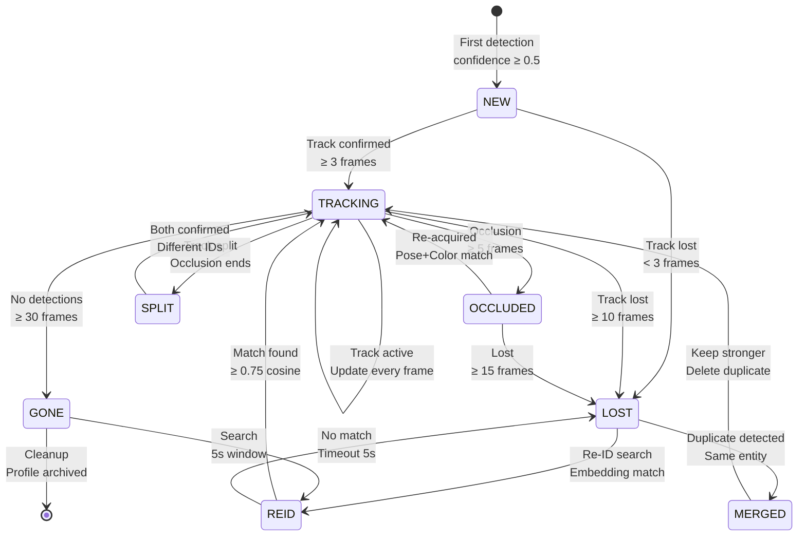
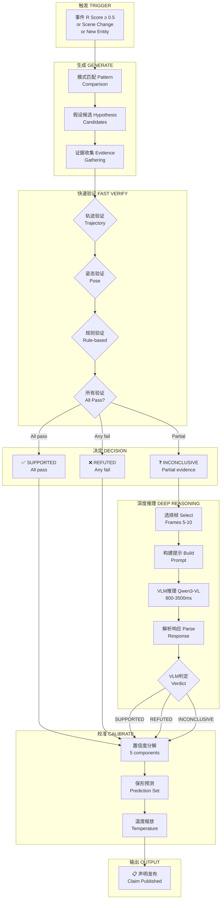

# Complete System Architecture — Full Reference

> This file contains ALL remaining diagrams: full system state machines, complete data pipeline layouts, production deployment topology, and all component interfaces.

---

## 1. Complete System Pipeline — Every Data Path

```mermaid
graph TB
    subgraph ╔══════════════════════════════════════════════════════════════╗
        direction TB
        subgraph INPUT["多媒体输入输入"]
            V["📹 视频流<br/>RTSP/HTTP/File<br/>30 FPS, H.264/H.265"]
            A["🔊 音频流<br/>PCM 16kHz mono<br/>1s chunks"]
            T["📝 文本触发<br/>OCR triggers<br/>Metadata"]
            P["🔒 来源证明<br/>C2PA manifests<br/>SynthID watermarks"]
        end
    end

    subgraph ╔══════════════════════════════════════════════════════════════╗
        direction TB
        subgraph PERC["感知层 PERCEPTION"]
            direction TB
            P1["解码 Decode<br/>H/W decoder 1-3ms"] --> P2["预处理 Preprocess<br/>Resize+Normalize 1-2ms"]
            P2 --> P3["跟踪 ByteTrack<br/>0.2-0.5ms"]
            P3 --> P4["检测 RF-DETR-S<br/>2.3-6.8ms"]
            P4 --> P5["姿态 DETRPose-S<br/>2.39-9.7ms"]
            P5 --> P6["状态更新<br/>Kalman 0.3-1ms"]
            P6 --> P7["事件评分<br/>R Score 0.1-0.3ms"]
            P7 --> P8["发布到Ring Buffer<br/>0.2-0.5ms"]
        end
    end

    subgraph ╔══════════════════════════════════════════════════════════════╗
        direction TB
        subgraph ASYNC["异步组件 Async Components"]
            direction TB
            AS1["分割 Segmentation<br/>RF-DETR-Seg 5-10ms"]
            AS2["OCR PaddleOCR<br/>15-40ms"]
            AS3["重识别 OSNet<br/>3-10ms"]
            AS4["音频 Whisper<br/>50-100ms"]
            AS5["相机运动<br/>ORB+RANSAC 1-3ms"]
        end
    end

    subgraph ╔══════════════════════════════════════════════════════════════╗
        direction TB
        subgraph FUSION["融合层 FUSION"]
            F1["多模态 Late/Attention<br/>2-10ms"]
            F2["时间融合 EMA<br/>0.5-3ms"]
            F3["跨模态对齐<br/>Correlation 1-3ms"]
        end
    end

    subgraph ╔══════════════════════════════════════════════════════════════╗
        direction TB
        subgraph STATE["状态层 STATE"]
            S1["🌍 世界状态<br/>Ring Buffer 30 frames<br/><0.1ms"]
            S2["👤 实体追踪<br/>Lifecycle 0.1ms"]
            S3["📈 轨迹模型<br/>Kalman 0.1ms"]
            S4["⚡ 事件检测<br/>Rules 0.2ms"]
        end
    end

    subgraph ╔══════════════════════════════════════════════════════════════╗
        direction TB
        subgraph MEMORY["记忆层 MEMORY"]
            M1["💾 短期记忆<br/>Ring Buffer 30<br/><0.1ms"]
            M2["🧠 工作记忆<br/>Hypotheses Top-10<br/>1ms"]
            M3["📚 长期记忆<br/>SQLite+FAISS<br/>10-50ms"]
            M4["📖 情景记忆<br/>Episode Store<br/>5-30ms"]
        end
    end

    subgraph ╔══════════════════════════════════════════════════════════════╗
        direction TB
        subgraph REASON["推理层 REASONING"]
            R1["🔮 假设引擎<br/>Rules+Pattern 5-15ms"]
            R2["✅ 快速验证<br/>Trajectory/Pose 1-5ms"]
            R3["深度VLM<br/>Qwen3-VL-30B<br/>800-3500ms"]
            R4["🔗 证据图<br/>Typed Graph 1-5ms"]
            R5["🔮 预测模型<br/>Trajectory 0.1ms"]
        end
    end

    subgraph ╔══════════════════════════════════════════════════════════════╗
        direction TB
        subgraph CAL["校准层 CALIBRATION"]
            C1["📊 置信度分解<br/>5 components <1ms"]
            C2["📏 保形预测<br/>α=0.05 2-5ms"]
            C3["🌡️ 温度缩放<br/><0.1ms"]
            C4["📋 声明输出<br/>Assemble 1-2ms"]
        end
    end

    subgraph ╔══════════════════════════════════════════════════════════════╗
        direction TB
        subgraph SCHED["调度层 SCHEDULER"]
            Q1["📅 多速率调度<br/>R Score <0.5ms"]
            Q2["📦 队列管理<br/>Bounded <0.5ms"]
            Q3["🚨 背压控制<br/>Threshold <0.2ms"]
            Q4["🖥️ GPU分配<br/>MPS/MIG <0.2ms"]
        end
    end

    subgraph ╔══════════════════════════════════════════════════════════════╗
        direction TB
        subgraph FOREN["取证层 FORENSICS"]
            K1["🔍 深度伪造<br/>Ensemble 200-2000ms"]
            K2["🔒 来源验证<br/>C2PA/SynthID 50-200ms"]
            K3["🔊 音频取证<br/>100-500ms"]
        end
    end

    subgraph ╔══════════════════════════════════════════════════════════════╗
        direction TB
        subgraph DOM["领域层 DOMAINS"]
            N1["⚽ 体育推理<br/>Rules+SoccerNet"]
            N2["📺 通用多媒体<br/>Domain-Agnostic"]
            N3["🤖 合成媒体<br/>Detection+Provenance"]
        end
    end

    subgraph ╔══════════════════════════════════════════════════════════════╗
        direction TB
        subgraph INFRA["基础设施 INFRASTRUCTURE"]
            I1["📐 数据模式<br/>Protobuf+FlatBuffers"]
            I2["🖥️ 硬件拓扑<br/>Tier 1-3 GPU"]
            I3["🚀 部署<br/>Docker/K8s/Helm"]
        end
    end

    subgraph ╔══════════════════════════════════════════════════════════════╗
        direction TB
        subgraph STORES["数据存储 DATA STORES"]
            direction LR
            DB1[("🗂️ 实体库<br/>SQLite")]
            DB2[("📊 事件库<br/>SQLite")]
            DB3[("📋 声明库<br/>SQLite")]
            DB4[("📏 校准库<br/>SQLite")]
            DB5[("🔍 取证库<br/>SQLite")]
            DB6[("🔢 向量库<br/>FAISS")]
            DB7[("📖 情景库<br/>SQLite")]
            DB8[("⚙️ 配置库<br/>JSON")]
        end
    end

    subgraph ╔══════════════════════════════════════════════════════════════╗
        direction TB
        subgraph OUTPUT["输出 OUTPUT"]
            O1["📋 结构化声明<br/>+ 置信度分解<br/>+ 保形预测集<br/>+ 证据引用<br/>+ 陈旧度标记"]
            O2["🌐 REST API<br/>FastAPI JSON"]
            O3["📡 WebSocket<br/>Live Stream"]
            O4["📨 Kafka<br/>NvSchema Async"]
        end
    end

    %% ═══════════════════════════════════════════════════════════
    %% INPUT CONNECTIONS
    %% ═══════════════════════════════════════════════════════════
    V --> P1
    A --> AS4
    T --> AS2
    P --> K2

    %% ═══════════════════════════════════════════════════════════
    %% PERCEPTION INTERNAL
    %% ═══════════════════════════════════════════════════════════
    P4 -->|"crops"| P5
    P4 -->|"detections"| AS1
    P4 -->|"detections"| AS2
    P4 -->|"embeddings"| AS3
    P4 -->|"features"| AS4

    %% ═══════════════════════════════════════════════════════════
    %% PERCEPTION → FUSION → STATE
    %% ═══════════════════════════════════════════════════════════
    P8 -->|state snapshot| F1
    AS4 -->|audio features| F1
    AS2 -->|text features| F1
    F1 --> F2
    F2 --> F3
    F3 -->|fused features| S1

    %% ═══════════════════════════════════════════════════════════
    %% STATE INTERNAL
    %% ═══════════════════════════════════════════════════════════
    P6 -->|entity updates| S1
    P5 -->|pose data| S1
    P4 -->|detections| S2
    S1 --> S2
    S2 --> S3
    S3 --> S4

    %% ═══════════════════════════════════════════════════════════
    %% STATE → MEMORY → REASONING
    %% ═══════════════════════════════════════════════════════════
    S1 -->|snapshot| M1
    M1 -->|flush 5s| M3
    M1 -->|promote| M2
    S4 -->|event trigger| Q1
    S1 -->|world state| R1
    M2 -->|hypothesis context| R1

    %% ═══════════════════════════════════════════════════════════
    %% REASONING INTERNAL
    %% ═══════════════════════════════════════════════════════════
    R1 --> R2
    R2 -->|supported/refuted| C4
    R2 -->|inconclusive| R3
    R1 --> R4
    R2 --> R4
    R3 --> R4
    S3 --> R5
    R5 -->|predictions| R1

    %% ═══════════════════════════════════════════════════════════
    %% REASONING → CALIBRATION
    %% ═══════════════════════════════════════════════════════════
    R2 -->|verified result| C1
    R3 -->|VLM result| C1
    R4 -->|evidence| C1
    C1 --> C2
    C2 --> C3
    C3 --> C4

    %% ═══════════════════════════════════════════════════════════
    %% SCHEDULER CONTROLS
    %% ═══════════════════════════════════════════════════════════
    Q1 --> Q2
    Q2 --> Q3
    Q3 --> Q4
    Q4 -.->|control perceive| P4
    Q4 -.->|control reason| R3
    Q4 -.->|control forensics| K1

    %% ═══════════════════════════════════════════════════════════
    %% FORENSICS
    %% ═══════════════════════════════════════════════════════════
    K2 -->|authenticity| N3
    K1 -->|detection| N3
    K3 -->|audio| N3
    N3 --> C4

    %% ═══════════════════════════════════════════════════════════
    %% DOMAINS
    %% ═══════════════════════════════════════════════════════════
    S4 -->|event| N1
    N1 --> C4
    N2 --> C4

    %% ═══════════════════════════════════════════════════════════
    %% CALIBRATION → OUTPUT
    %% ═══════════════════════════════════════════════════════════
    C4 --> O1
    O1 --> O2
    O1 --> O3
    O1 --> O4

    %% ═══════════════════════════════════════════════════════════
    %% DATA STORES
    %% ═══════════════════════════════════════════════════════════
    S1 -.->|write| DB1
    S4 -.->|write| DB2
    C4 -.->|write| DB3
    C2 -.->|write| DB4
    K1 -.->|write| DB5
    M3 -.->|write| DB6
    M4 -.->|write| DB7
    Q1 -.->|read/write| DB8
```

---

## 2. Complete Entity Lifecycle State Machine



---

## 3. Complete Hypothesis Decision Tree



---

## 4. Complete Evidence Graph Structure

```mermaid
graph TB
    subgraph ╔══════════════════════════════════════════════════════════════════════╗
        direction TB
        subgraph NODES["节点类型 NODE TYPES"]
            N1["🔲 PerceptionNode<br/>══════════════════<br/>frame_id, entity_id<br/>bbox, pose, class<br/>confidence, timestamp<br/>source_model"]
            N2["🔲 TrackingNode<br/>══════════════════<br/>track_id, frames<br/>avg_velocity, direction<br/>disappearance_count"]
            N3["🔲 ActionNode<br/>══════════════════<br/>action_class<br/>start_frame, end_frame<br/>confidence, tempo"]
            N4["🔲 SpatialNode<br/>══════════════════<br/>region, zone<br/>adjacent_regions<br/>density"]
            N5["🔲 TemporalNode<br/>══════════════════<br/>window_start, window_end<br/>event_frequency<br/>anomaly_score"]
            N6["🔲 CausalNode<br/>══════════════════<br/>cause_id, effect_id<br/>delay_ms, probability<br/>confidence_interval"]
            N7["🔲 ClaimSupportNode<br/>══════════════════<br/>claim_id, support_score<br/>total_weight, num_paths<br/>strongest_path"]
        end
    end

    subgraph ╔══════════════════════════════════════════════════════════════════════╗
        direction TB
        subgraph EDGES["边类型 EDGE TYPES"]
            E1["── TemporalEdge<br/>from → to<br/>lag_ms, confidence"]
            E2["── SpatialEdge<br/>from → to<br/>distance, overlap<br/>direction"]
            E3["── CausalEdge<br/>from → to<br/>probability, delay<br/>evidence_count"]
            E4["── SemanticEdge<br/>from → to<br/>relation, weight"]
            E5["── TrackingEdge<br/>from → to<br/>track_continuity<br/>appearance_sim"]
            E6["── EvidenceEdge<br/>from → to<br/>weight_llr<br/>supportive/refutive"]
            E7["── NegationEdge<br/>from → to<br/>negation_type<br/>confidence"]
        end
    end

    subgraph ╔══════════════════════════════════════════════════════════════════════╗
        direction TB
        subgraph QUERIES["查询操作 QUERIES"]
            Q1["get_support_paths(claim_id)<br/>→ EvidencePath[]"]
            Q2["get_weakest_link(path)<br/>→ Edge"]
            Q3["get_conflicting_evidence(claim_id)<br/>→ EvidenceEdge[]"]
            Q4["get_temporal_chain(start, end)<br/>→ Node[]"]
            Q5["propagate_uncertainty(node_id)<br/>→ float"]
        end
    end

    subgraph ╔══════════════════════════════════════════════════════════════════════╗
        direction TB
        subgraph STORAGE["存储 STORAGE"]
            S1["SQLite: nodes, edges, metadata"]
            S2["FAISS: node embeddings for similarity"]
            S3["NetworkX: in-memory graph for queries"]
            S4["Periodic: graph snapshots every 100 frames"]
        end
    end
```

---

## 5. Complete Data Flow with All Buffers

```mermaid
graph TB
    subgraph ╔══════════════════════════════════════════════════════════════════════╗
        direction TB
        subgraph BUFFERS["数据缓冲区 DATA BUFFERS"]
            direction TB
            B1["📥 输入缓冲 Input Buffer<br/>══════════════════════════<br/>Frame Queue: depth=8<br/>Audio Queue: depth=4<br/>Metadata Queue: depth=4<br/>Type: bounded mpsc channel"]
            B2["📤 输出缓冲 Output Buffer<br/>══════════════════════════<br/>Claim Queue: depth=32<br/>Event Queue: depth=256<br/>Type: bounded mpsc channel"]
            B3["🔄 循环缓冲 Ring Buffer<br/>══════════════════════════<br/>State Ring: 30 slots<br/>Perception Ring: 30 slots<br/>Alignment Ring: 30 slots<br/>Type: pre-allocated array"]
            B4["📦 作业缓冲 Job Buffers<br/>══════════════════════════<br/>Fast Verify Queue: depth=32<br/>Deep VLM Queue: depth=4<br/>Forensics Queue: depth=8<br/>Priority Queue: depth=16"]
        end
    end

    subgraph ╔══════════════════════════════════════════════════════════════════════╗
        direction TB
        subgraph FLOW["数据流向 DATA FLOW"]
            direction TB
            F1["Frame In → Input Buffer → Perception"]
            F2["Perception → State Ring → World State"]
            F3["World State → Reasoning Job Queue"]
            F4["Reasoning → Output Buffer → Claim"]
            F5["Claim → Kafka/API/WebSocket"]
            F6["Memory Flush → SQLite → FAISS"]
        end
    end

    B1 --> F1
    F1 --> F2
    F2 --> F3
    F3 --> F4
    F4 --> F5
    F5 --> F6
```

---

## 6. Complete API Endpoints with Data Contracts

```mermaid
graph TB
    subgraph ╔══════════════════════════════════════════════════════════════════════╗
        direction TB
        subgraph REST["REST API ENDPOINTS"]
            direction TB
            R1["GET /api/v1/state/current<br/>══════════════════════════<br/>Response: WorldStateSnapshot<br/>26 entities max, 30 frames<br/>Latency: <1ms"]
            R2["GET /api/v1/state/{timestamp}<br/>══════════════════════════<br/>Response: WorldStateSnapshot<br/>From ring buffer or replay<br/>Latency: <1ms"]
            R3["GET /api/v1/entity/{id}<br/>══════════════════════════<br/>Response: Entity<br/>Full profile + trajectory<br/>Latency: 1-5ms"]
            R4["GET /api/v1/entity/{id}/history?window=<br/>══════════════════════════<br/>Response: EntityState[]<br/>Temporal window of states<br/>Latency: 5-20ms"]
            R5["GET /api/v1/events?from=&to=&type=<br/>══════════════════════════<br/>Response: Event[]<br/>Filtered event list<br/>Latency: 10-50ms"]
            R6["GET /api/v1/claims?from=&to=&domain=<br/>══════════════════════════<br/>Response: Claim[]<br/>Filtered claims<br/>Latency: 10-50ms"]
            R7["GET /api/v1/claims/{id}<br/>══════════════════════════<br/>Response: Claim + Evidence<br/>Full claim with graph<br/>Latency: 5-20ms"]
            R8["GET /api/v1/hypotheses/active<br/>══════════════════════════<br/>Response: HypothesisSet<br/>Current active hypotheses<br/>Latency: 1-5ms"]
            R9["GET /api/v1/forensics/{media_id}<br/>══════════════════════════<br/>Response: ForensicResult<br/>Detection + Provenance<br/>Latency: 50-2000ms"]
            R10["GET /api/v1/health<br/>══════════════════════════<br/>Response: SystemHealth<br/>CPU, GPU, Memory, Queue depths<br/>Latency: <1ms"]
        end
    end

    subgraph ╔══════════════════════════════════════════════════════════════════════╗
        direction TB
        subgraph POST["POST ENDPOINTS"]
            direction TB
            P1["POST /api/v1/stream/register<br/>══════════════════════════<br/>Request: StreamConfig<br/>Response: StreamHandle<br/>Registers new video stream"]
            P2["POST /api/v1/stream/{id}/query<br/>══════════════════════════<br/>Request: ReasoningQuery<br/>Response: Claim<br/>Ask question about stream"]
            P3["POST /api/v1/forensics/analyze<br/>══════════════════════════<br/>Request: MediaUpload<br/>Response: ForensicResult<br/>Submit media for analysis"]
            P4["POST /api/v1/reasoning/investigate<br/>══════════════════════════<br/>Request: InvestigationRequest<br/>Response: InvestigationHandle<br/>Trigger deep investigation"]
        end
    end

    subgraph ╔══════════════════════════════════════════════════════════════════════╗
        direction TB
        subgraph WS["WEBSOCKET ENDPOINTS"]
            direction TB
            W1["WS /api/v1/stream/{id}/live<br/>══════════════════════════<br/>→ Live claim stream<br/>SSE events<br/>Real-time inference"]
            W2["WS /api/v1/events/live<br/>══════════════════════════<br/>→ Live event feed<br/>All event types<br/>Filtered by subscription"]
        end
    end

    subgraph ╔══════════════════════════════════════════════════════════════════════╗
        direction TB
        subgraph KAFKA["KAFKA TOPICS"]
            direction TB
            K1["Topic: perception.detections<br/>══════════════════════════<br/>Key: frame_id<br/>Value: DetectionBatch<br/>Partitions: 4"]
            K2["Topic: state.snapshots<br/>══════════════════════════<br/>Key: timestamp<br/>Value: WorldStateSnapshot<br/>Partitions: 4"]
            K3["Topic: events.triggered<br/>══════════════════════════<br/>Key: event_id<br/>Value: EventTrigger<br/>Partitions: 4"]
            K4["Topic: claims.published<br/>══════════════════════════<br/>Key: claim_id<br/>Value: Claim<br/>Partitions: 4"]
            K5["Topic: forensics.results<br/>══════════════════════════<br/>Key: media_id<br/>Value: ForensicResult<br/>Partitions: 4"]
            K6["Topic: vlm.requests<br/>══════════════════════════<br/>Key: hypothesis_id<br/>Value: VLMReasoningInput<br/>Partitions: 2"]
            K7["Topic: vlm.responses<br/>══════════════════════════<br/>Key: hypothesis_id<br/>Value: VLMReasoningOutput<br/>Partitions: 2"]
        end
    end
```

---

## 7. Complete Deployment Topology

```mermaid
graph TB
    subgraph ╔══════════════════════════════════════════════════════════════════════╗
        direction TB
        subgraph SINGLE["TIER 1: 单节点部署 SINGLE NODE"]
            direction TB
            subgraph K8S1["Kubernetes Cluster"]
                direction TB
                subgraph NS1["namespace: multimodal-reasoner"]
                    direction TB
                    subgraph POD1["Pod: perception (GPU 0)"]
                        P1A["Container: perception<br/>Image: reasoning/perception:latest<br/>GPU: 1x RTX 4090<br/>CPU: 8 cores<br/>Memory: 16GB<br/>Replicas: 1"]
                    end
                    subgraph POD2["Pod: reasoning (GPU 1)"]
                        P2A["Container: reasoning<br/>Image: reasoning/vlm:latest<br/>GPU: 1x RTX 4090<br/>CPU: 8 cores<br/>Memory: 32GB<br/>Replicas: 1"]
                    end
                    subgraph POD3["Pod: state-management"]
                        P3A["Container: state<br/>Image: reasoning/state:latest<br/>CPU: 4 cores<br/>Memory: 8GB<br/>Replicas: 1"]
                    end
                    subgraph POD4["Pod: api-gateway"]
                        P4A["Container: api<br/>Image: reasoning/api:latest<br/>CPU: 2 cores<br/>Memory: 4GB<br/>Replicas: 1"]
                    end
                    subgraph POD5["Pod: scheduler"]
                        P5A["Container: scheduler<br/>Image: reasoning/scheduler:latest<br/>CPU: 2 cores<br/>Memory: 4GB<br/>Replicas: 1"]
                    end
                end
            end
        end
    end

    subgraph ╔══════════════════════════════════════════════════════════════════════╗
        direction TB
        subgraph MULTI["TIER 3: 多节点部署 MULTI-NODE"]
            direction TB
            subgraph K8S3["Kubernetes Cluster"]
                direction LR
                subgraph NODE1["Node 1: GPU"]
                    N1A["Pod: perception<br/>GPU: 1x A100"]
                    N1B["Pod: fast-reasoning<br/>GPU: 1x A100"]
                end
                subgraph NODE2["Node 2: GPU"]
                    N2A["Pod: deep-vlm<br/>GPU: 2x A100<br/>TP=2"]
                    N2B["Pod: forensics<br/>GPU: 1x A100"]
                end
                subgraph NODE3["Node 3: CPU"]
                    N3A["Pod: state-management"]
                    N3B["Pod: memory"]
                    N3C["Pod: scheduler"]
                end
                subgraph NODE4["Node 4: CPU"]
                    N4A["Pod: api-gateway"]
                    N4B["Pod: kafka-broker"]
                    N4C["Pod: prometheus"]
                end
            end
        end
    end

    subgraph INFRA_K8S["基础设施 INFRASTRUCTURE"]
        direction LR
        INF1["NVIDIA Device Plugin<br/>GPU discovery + allocation"]
        INF2["NVIDIA GPU Operator<br/>Driver + runtime management"]
        INF3["Prometheus + Grafana<br/>Metrics collection + dashboards"]
        INF4["Jaeger<br/>Distributed tracing"]
    end
```

---

## 8. Complete Latency Budget — Frame to Claim

```mermaid
graph LR
    subgraph ╔══════════════════════════════════════════════════════════════╗
        direction LR
        subgraph CRITICAL["🔴 关键路径 CRITICAL PATH (30 FPS)"]
            direction LR
            C1["Decode<br/>1-3ms"]
            C2["Preprocess<br/>1-2ms"]
            C3["Track<br/>0.2ms"]
            C4["Detect<br/>3.5ms"]
            C5["Pose<br/>2.4ms"]
            C6["State<br/>0.5ms"]
            C7["Event<br/>0.2ms"]
            C8["Publish<br/>0.3ms"]
            CT["TOTAL<br/>8-12ms"]
        end
    end

    subgraph ╔══════════════════════════════════════════════════════════════╗
        direction LR
        subgraph FAST["🟡 快速推理 FAST REASONING (5-10 Hz)"]
            direction LR
            F1["Hypothesis<br/>5-15ms"]
            F2["Fast Verify<br/>1-5ms"]
            FT["TOTAL<br/>6-20ms"]
        end
    end

    subgraph ╔══════════════════════════════════════════════════════════════╗
        direction LR
        subgraph DEEP["🟠 深度推理 DEEP REASONING (0.3-0.5 Hz)"]
            direction LR
            D1["Frame Selection<br/>5-10ms"]
            D2["Prompt Build<br/>1-2ms"]
            D3["VLM Inference<br/>800-3500ms"]
            D4["Parse Response<br/>5-10ms"]
            DT["TOTAL<br/>811-3522ms"]
        end
    end

    subgraph ╔══════════════════════════════════════════════════════════════╗
        direction LR
        subgraph CALIB["🟢 校准输出 CALIBRATION (always)"]
            direction LR
            CA1["Decompose<br/><1ms"]
            CA2["Conformal<br/>2-5ms"]
            CA3["Temperature<br/><0.1ms"]
            CA4["Assemble<br/>1-2ms"]
            CAT["TOTAL<br/>3-8ms"]
        end
    end

    subgraph ╔══════════════════════════════════════════════════════════════╗
        direction LR
        subgraph TOTAL["⏱️ 总延迟 TOTAL LATENCY"]
            direction LR
            T1["Fast Path<br/>17-40ms"]
            T2["Deep Path<br/>814-3530ms"]
        end
    end

    CT --> FT
    FT --> CAT
    FT -->|inconclusive| DT
    DT --> CAT
    CAT --> T1
    CAT --> T2
```

---

## 9. Complete System Integration Matrix

```mermaid
graph TB
    subgraph ╔══════════════════════════════════════════════════════════════════════╗
        direction TB
        subgraph MATRIX["组件集成矩阵 COMPONENT INTEGRATION MATRIX"]
            direction TB
            M1["感知层 Perception:<br/>══════════════════════════════════<br/>Detection → Pose (crops)<br/>Detection → Tracking (detections)<br/>Detection → Segmentation (regions)<br/>Detection → OCR (regions)<br/>Detection → ReID (embeddings)<br/>Tracking → State (tracks)<br/>Pose → State (poses)<br/>Camera → State (motion)<br/>Audio → Fusion (features)"]
            M2["融合层 Fusion:<br/>══════════════════════════════════<br/>Perception → Fusion (raw features)<br/>Fusion → Temporal (smoothed)<br/>Temporal → Alignment (synced)<br/>Alignment → State (fused)"]
            M3["状态层 State:<br/>══════════════════════════════════<br/>World State → Entity Tracker<br/>Entity Tracker → Trajectory<br/>Trajectory → Event Detection<br/>Event Detection → Scheduler"]
            M4["记忆层 Memory:<br/>══════════════════════════════════<br/>State → Short-Term (ring buffer)<br/>Short-Term → Working (promote)<br/>Short-Term → Long-Term (flush 5s)<br/>Working → Episodic (episode)<br/>Long-Term → VLM (historical)"]
            M5["推理层 Reasoning:<br/>══════════════════════════════════<br/>State → Hypothesis (world state)<br/>Memory → Hypothesis (context)<br/>Prediction → Hypothesis (extrapolation)<br/>Hypothesis → Fast Verify<br/>Fast Verify → Claim (if pass)<br/>Fast Verify → VLM (if inconclusive)<br/>All → Evidence Graph"]
            M6["校准层 Calibration:<br/>══════════════════════════════════<br/>Fast Verify → Confidence<br/>VLM → Confidence<br/>Evidence Graph → Confidence<br/>Confidence → Conformal<br/>Conformal → Temperature<br/>Temperature → Claim Output"]
            M7["调度层 Scheduler:<br/>══════════════════════════════════<br/>Events → Multi-Rate (priority)<br/>Multi-Rate → Queue Manager<br/>Queue Manager → Backpressure<br/>Backpressure → GPU Distributor<br/>GPU Distributor → all GPU components"]
            M8["取证层 Forensics:<br/>══════════════════════════════════<br/>C2PA → Provenance<br/>Deepfake → Detection<br/>Audio → Forensics<br/>All → Domain Layer"]
            M9["领域层 Domains:<br/>══════════════════════════════════<br/>Events → Domain Router<br/>Domain Router → Sports/General/Synthetic<br/>Domain → Claim Output"]
        end
    end
```

---

## 10. Complete System Summary — All Components, All Data

```mermaid
graph TB
    subgraph ╔══════════════════════════════════════════════════════════════════════╗
        direction TB
        subgraph SUMMARY["系统总结 SYSTEM SUMMARY"]
            direction TB
            S1["📦 组件统计 COMPONENT COUNT<br/>══════════════════════════════════<br/>感知: 8 components<br/>融合: 3 components<br/>状态: 4 components<br/>记忆: 4 components<br/>推理: 5 components<br/>校准: 4 components<br/>调度: 4 components<br/>取证: 3 components<br/>领域: 3 components<br/>基础设施: 3 components<br/>TOTAL: 41 components"]
            S2["💾 数据存储 DATA STORES<br/>══════════════════════════════════<br/>SQLite: 7 databases<br/>FAISS: 2 vector indices<br/>Ring Buffers: 4 pre-allocated<br/>Job Queues: 4 bounded<br/>Kafka Topics: 7 topics"]
            S3["📊 数据模式 DATA SCHEMAS<br/>══════════════════════════════════<br/>Protobuf Messages: 15 types<br/>FlatBuffers: 8 types<br/>JSON Schemas: 12 types<br/>API Endpoints: 16 endpoints<br/>Kafka Messages: 7 types"]
            S4["⏱️ 延迟预算 LATENCY BUDGET<br/>══════════════════════════════════<br/>Critical Path: 8-12ms<br/>Fast Reasoning: 6-20ms<br/>Deep Reasoning: 811-3522ms<br/>Calibration: 3-8ms<br/>Total Fast: 17-40ms<br/>Total Deep: 814-3530ms"]
            S5["🖥️ 硬件需求 HARDWARE<br/>══════════════════════════════════<br/>Tier 1: 1× RTX 4090 (24GB)<br/>Tier 2: 2× RTX 4090 or 1× A100<br/>Tier 3: 4× A100/H100<br/>CPU: 8-16 cores<br/>RAM: 32-128GB<br/>Storage: 1-4TB NVMe"]
            S6["🚀 部署模式 DEPLOYMENT<br/>══════════════════════════════════<br/>Docker: single container per component<br/>Kubernetes: pods with GPU scheduling<br/>Helm: parameterized deployments<br/>Prometheus: metrics collection<br/>Grafana: monitoring dashboards<br/>Jaeger: distributed tracing"]
        end
    end
```
